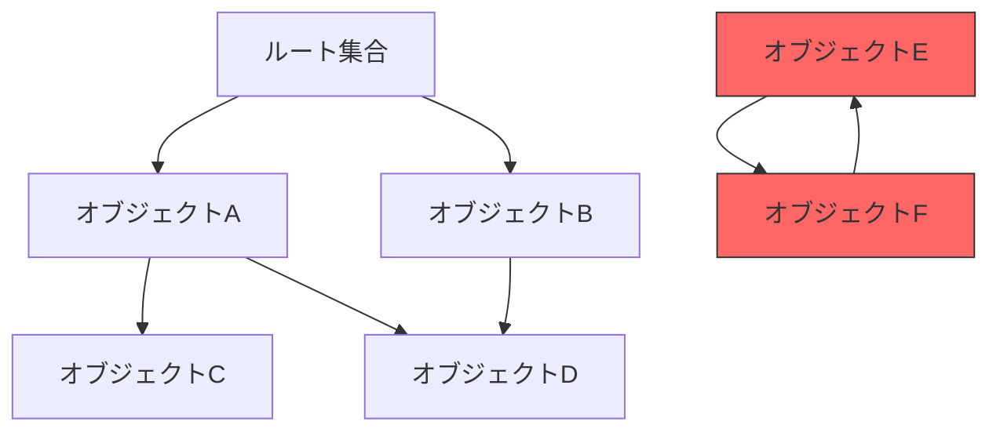

# GCの基礎

## GCとは何か

ガーベージコレクション（GC）は、プログラムが動的に確保したメモリのうち、もはや到達不可能（unreachable）となったオブジェクトを自動的に回収する仕組みである。1960年に[](#cite:mccarthy1960)がLISP処理系のために考案して以来、60年以上にわたって研究と実装が続けられている。

GCの基本的な問題は次のように定式化できる。

> [!NOTE]
> **GCの基本問題**: ヒープ上に確保されたオブジェクトの集合から、ルート集合（スタック、レジスタ、グローバル変数）から到達可能なオブジェクトを特定し、到達不可能なオブジェクトのメモリを回収せよ。



上図では、オブジェクトEとFは相互参照しているが、ルート集合からは到達不可能であるため、ガーベージ（ゴミ）である。

## GCの分類体系

GCアルゴリズムは大きく2つのアプローチに分類される。

**トレーシング（Tracing）GC**: ルート集合から到達可能なオブジェクトを追跡し、到達できなかったオブジェクトをゴミと判定する。Mark-Sweep、コピーGC、Mark-Compactなどが該当する。

**参照カウント（Reference Counting）**: 各オブジェクトが被参照数を保持し、カウントがゼロになった時点で即座に回収する。[](#cite:collins1960)が1960年に提案した方式である。

[](#cite:bacon2004)は、トレーシングと参照カウントが実は同一の問題の[双対](#index:双対,GC/双対)であることを示した。これは本書の第7章で詳しく議論する。

[](#cite:wilson1992)による包括的なサーベイは、GCアルゴリズムの古典的分類を確立した。最新の体系的整理は[](#cite:jones2023)の教科書第2版に詳しい。

## オブジェクトグラフの表現

本書では疑似コードにRubyを用いる。まず、GCの基本的なデータ構造を定義しよう。

```ruby
class GCObject
  attr_accessor :marked      # トレーシング用マーク
  attr_accessor :ref_count   # 参照カウント
  attr_accessor :fields      # 他オブジェクトへの参照の配列

  def initialize
    @marked = false
    @ref_count = 0
    @fields = []
  end
end

class Heap
  attr_reader :objects, :roots, :free_list

  def initialize(size)
    @objects = []
    @roots = []
    @free_list = []
  end

  def allocate
    if @free_list.empty?
      collect  # GCを起動
    end
    raise "OutOfMemory" if @free_list.empty?
    @free_list.pop
  end
end
```

## 到達可能性の定義

GCの正しさを議論するために、[到達可能性](#index:到達可能性)（reachability）を厳密に定義する。

```ruby
def reachable?(heap, obj)
  visited = Set.new
  worklist = heap.roots.dup

  while (current = worklist.pop)
    next if visited.include?(current)
    visited.add(current)
    return true if current == obj
    current.fields.each { |child| worklist.push(child) }
  end

  false
end
```

GCの**安全性**（safety）とは、到達可能なオブジェクトを絶対に回収しないことである。GCの**完全性**（completeness）とは、到達不可能なオブジェクトをすべて回収することである。実用上、完全性は必ずしも保証されない場合がある（例: [保守的GC](#index:保守的GC)）。

## メモリ管理の手法比較

GCを使わない手法も含め、メモリ管理の選択肢を整理しておく。

| 手法 | 安全性 | 決定的解放 | 循環参照 | オーバーヘッド | 主な採用処理系 |
|------|--------|------------|----------|----------------|----------------|
| 手動管理 (malloc/free) | × | ○ | N/A | 低 | C, C++ |
| RAII / スコープベース | △ | ○ | × | 低 | Rust, C++（スマートポインタ） |
| 参照カウント | ○ | ○ | × | 中 | CPython, Swift (ARC), Objective-C, Perl |
| トレーシングGC | ○ | × | ○ | 中〜高 | JVM, Go, CRuby, .NET CLR, V8, OCaml |
| リージョンベース | ○ | ○ | ○ | 低〜中 | MLKit, Cyclone（研究言語） |

> [!TIP]
> 各手法には一長一短がある。実際の処理系では複数の手法を組み合わせることが多い。例えばRustの所有権システムはRAIIベースだが、`Rc<T>`で参照カウントも提供する。

## メモリ割り当ての機構

GCは「回収」の技術だが、メモリ管理のもう半分は「割り当て（allocation）」である。どう割り当てるかは、どう回収するかと表裏一体であり、GC方式の選択は割り当て方式の選択でもある。割り当て機構を理解せずにGCを語ることはできない。

代表的な割り当て方式は3つに大別される。

- **バンプポインタ割り当て（bump pointer / sequential allocation）**: 連続した空き領域の先頭を指すポインタを持ち、要求サイズだけポインタを進めて返す。`O(1)`で、機械語数命令で済むほど高速。ただし途中に空きを作れないため、コピーGCやリージョンのように「まとめて空にできる」回収方式と組み合わせる必要がある。
- **フリーリスト割り当て（free-list allocation）**: 空き領域を連結リストで管理し、要求に合うブロックを探して返す。任意の場所を個別に解放できるため、Mark-Sweepのように移動しない回収方式と相性がよい。反面、探索コストと断片化（fragmentation）が問題になる。
- **サイズ別分離割り当て（segregated-fit / size class）**: あらかじめ「16バイト用」「32バイト用」…といったサイズクラスごとにフリーリストを分け、要求サイズを最も近いクラスに丸めて割り当てる。探索を`O(1)`に近づけつつ、クラス内では断片化を抑えられる。多くの実用的アロケータの基礎となっている。

```ruby
# バンプポインタ割り当ての本質（数命令で済む）
class BumpAllocator
  def initialize(region_start, region_end)
    @cursor = region_start
    @end = region_end
  end

  def allocate(size)
    obj = @cursor
    new_cursor = @cursor + size
    return nil if new_cursor > @end   # 領域が尽きた → GCを起動する合図
    @cursor = new_cursor
    obj
  end
end
```

### マルチスレッド環境とTLAB

複数のスレッドが同時に割り当てを行う処理系では、共有のバンプポインタを更新するたびにロックやアトミック操作が必要になり、これがボトルネックになる。これを避けるのが[TLAB](#index:TLAB)（Thread-Local Allocation Buffer, スレッドローカル割り当てバッファ）である。各スレッドにヒープの一区画をあらかじめ「卸して」おき、スレッドはその中をロックなしのバンプポインタ割り当てで消費する。区画を使い切ったときだけ、共有ヒープから新しい区画を（同期して）取得する。HotSpot JVM、Go、.NETなど主要処理系はいずれもこの仕組みを持ち、割り当ての大半を同期なしの数命令で処理している。

### 汎用アロケータとの関係

GCを持たないCやC++では、`malloc`/`free`を実装する汎用アロケータが同じ問題（サイズクラス、断片化、マルチスレッドのスケーラビリティ）に取り組んでいる。jemalloc（FreeBSD・かつてのFacebook）、tcmalloc（Google）、そして[mimalloc](#index:mimalloc)（Microsoft）が代表例である。とくにmimallocは、フリーリストをページ単位に分割（sharding）して局所性とスケーラビリティを高めた設計で、本書で後述する精密参照カウントのPerceus（[](#cite:reinking2021)）と同じDaan Leijenらによるものであり[](#cite:leijen2019mimalloc)、「割り当て器の設計」と「回収戦略の設計」が地続きであることを示す好例である。これらの知見は、GCのアロケータ部分（特にMark-Sweepやリージョン内の割り当て）にも直接応用されている。

## GCの評価指標

GC実装の品質は以下の指標で評価される[](#cite:blackburn2004)。

- **スループット**: アプリケーションの実行時間に対するGCのオーバーヘッド比率
- **最大停止時間**: GCによるStop-the-World（STW）の最長時間
- **テイルレイテンシ**: 99.9パーセンタイルや99.99パーセンタイルでの停止時間
- **メモリ使用量**: ヒープのフットプリントとフラグメンテーション
- **スケーラビリティ**: コア数やヒープサイズに対する性能のスケール特性


これらの指標は互いにトレードオフの関係にある。例えば、スループットを最大化するにはSTW型のGCが有利だが、レイテンシは犠牲になる。現代のGC研究の主要なテーマの一つは、このトレードオフをいかに緩和するかである。

## 本書の構成

本書は3部構成である。第I部（基礎編）では、基本的なGCアルゴリズムを解説する。第II部（発展編）では、並行GC、リージョンベースGC、統一理論など、より高度な話題を扱う。第III部（最前線編）では、主要処理系の実装と最新研究を紹介し、今後の展望を論じる。
