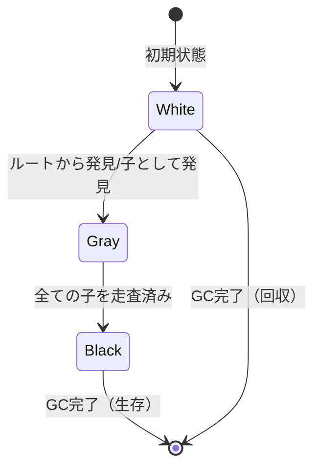
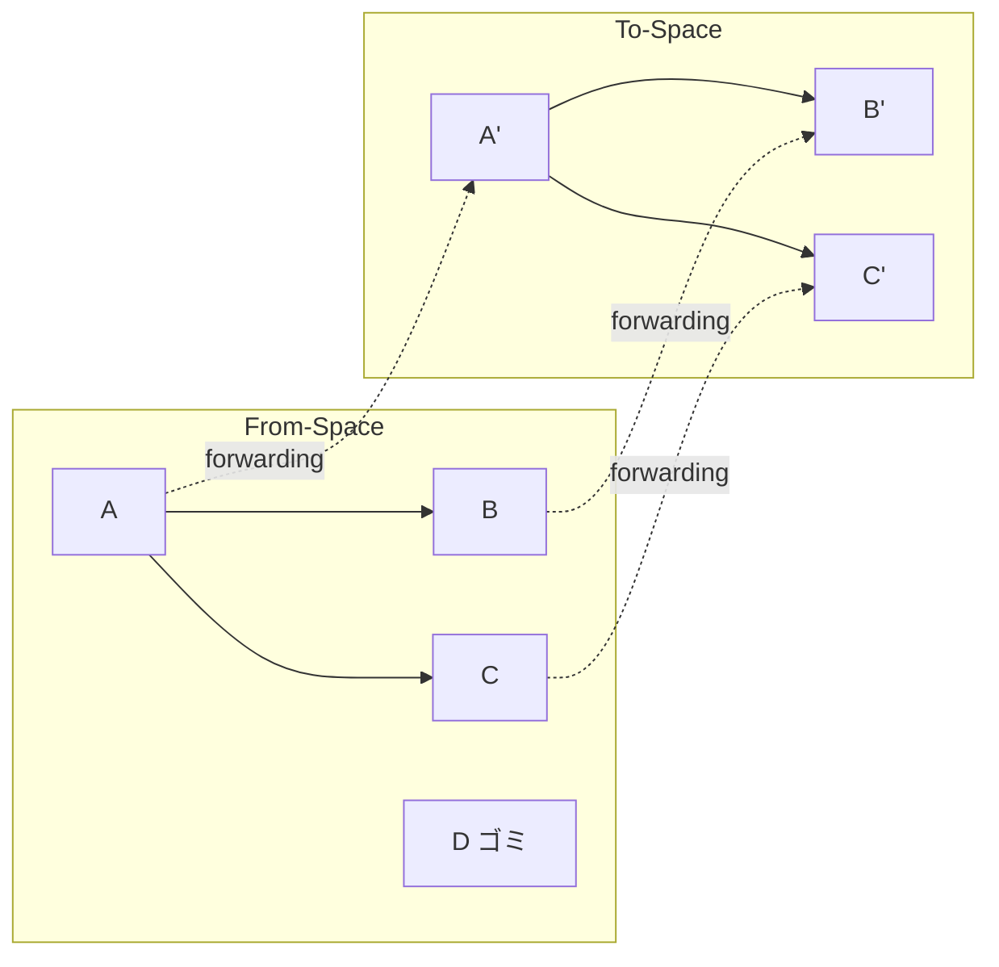
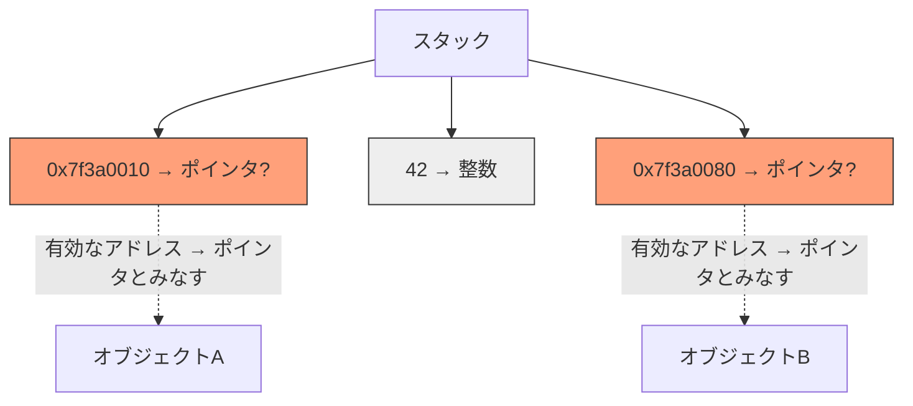

# トレーシングGC

## 概要

[トレーシングGC](#index:トレーシングGC)は、ルート集合からオブジェクトグラフを走査（トレース）し、到達可能なオブジェクトを特定する手法の総称である。到達不可能と判定されたオブジェクトのメモリを回収する。[McCarthy](#cite:mccarthy1960)のLISP処理系に端を発し、現在最も広く使われているGC方式である。

## Mark-Sweep

### アルゴリズム

[Mark-Sweep](#index:Mark-Sweep)は最も基本的なトレーシングGCである。2つのフェーズからなる。

1. **マークフェーズ**: ルート集合から到達可能な全オブジェクトにマークを付ける
2. **スイープフェーズ**: ヒープ全体を走査し、マークのないオブジェクトをフリーリストに返す

```ruby
class MarkSweepCollector
  def initialize(heap)
    @heap = heap
  end

  def collect
    mark_phase
    sweep_phase
  end

  private

  def mark_phase
    worklist = @heap.roots.dup
    while (obj = worklist.pop)
      next if obj.marked
      obj.marked = true
      obj.fields.each { |child| worklist.push(child) if child }
    end
  end

  def sweep_phase
    @heap.objects.each do |obj|
      if obj.marked
        obj.marked = false  # 次回GCに備えてリセット
      else
        @heap.free_list.push(obj)
      end
    end
  end
end
```

### 三色抽象

[Dijkstra et al.](#cite:dijkstra1978)は、トレーシングGCの進行状態を[三色抽象](#index:三色抽象)（tri-color abstraction）で形式化した。この概念は並行GCの正しさの議論に不可欠である。

- **白（White）**: まだ訪問されていないオブジェクト。GC終了時に白のままなら到達不可能
- **灰（Gray）**: 自身は訪問されたが、子の走査がまだ完了していないオブジェクト
- **黒（Black）**: 自身も全ての子も訪問済みのオブジェクト



GCの**不変条件**（invariant）として、黒いオブジェクトは白いオブジェクトを直接参照しないことが求められる。これを三色不変条件と呼ぶ。

```ruby
class TriColorMarkSweep
  WHITE = 0
  GRAY  = 1
  BLACK = 2

  def initialize(heap)
    @heap = heap
    @worklist = []  # 灰色オブジェクトのリスト
  end

  def collect
    # 全オブジェクトを白にする
    @heap.objects.each { |obj| obj.color = WHITE }

    # ルートから灰色にする
    @heap.roots.each do |root|
      root.color = GRAY
      @worklist.push(root)
    end

    # 灰色がなくなるまでトレース
    while (obj = @worklist.pop)
      obj.fields.each do |child|
        next unless child
        if child.color == WHITE
          child.color = GRAY
          @worklist.push(child)
        end
      end
      obj.color = BLACK
    end

    # 白いオブジェクトを回収
    @heap.objects.reject! { |obj| obj.color == WHITE }
  end
end
```

### 長所と短所

Mark-Sweepの長所:
- 実装が比較的単純
- オブジェクトを移動しない（ポインタの更新不要）
- コンサバティブGCとの相性が良い[（Boehm and Weiser）](#cite:boehm1988)

短所:
- フラグメンテーションが発生する
- 割り当てにフリーリスト探索が必要
- ヒープ全体のスイープが必要

実際の採用例: Go言語（非移動式の並行Mark-Sweep）、CRuby（遅延スイープ付きMark-Sweep）、Lua（インクリメンタルMark-Sweep）。V8エンジンもメジャーGCでMark-Sweepを使用する。

## コピーGC

### Cheneyのアルゴリズム

[コピーGC](#index:コピーGC)は、ヒープを2つの半空間（from-space/to-space）に分割し、到達可能なオブジェクトをfrom-spaceからto-spaceにコピーする方式である。[Cheney](#cite:cheney1970)が提案した幅優先コピーアルゴリズムは、補助スタックを使わず再帰もしない、非常にエレガントな実装である。

```ruby
class CheneyCollector
  def initialize(heap_size)
    @heap_size = heap_size
    @from_space = Array.new(heap_size)
    @to_space = Array.new(heap_size)
    @free = 0        # to-space内の次の空き位置
    @scan = 0        # to-space内のスキャン位置
  end

  def collect(roots)
    # from/toを入れ替え
    @from_space, @to_space = @to_space, @from_space
    @free = 0
    @scan = 0

    # ルートをコピー
    roots.map! { |root| copy(root) }

    # 幅優先でスキャン
    while @scan < @free
      obj = @to_space[@scan]
      obj.fields.map! { |child| child ? copy(child) : nil }
      @scan += 1
    end
  end

  private

  def copy(obj)
    # 既にコピー済みならフォワーディングポインタを返す
    return obj.forwarding if obj.forwarding

    # to-spaceにコピー
    new_obj = obj.dup
    @to_space[@free] = new_obj
    @free += 1

    # フォワーディングポインタを設定
    obj.forwarding = new_obj
    new_obj
  end
end
```



### コピーGCの特徴

長所:
- フラグメンテーションが発生しない（コンパクション効果）
- 割り当てがバンプポインタで高速（O(1)）
- 到達可能オブジェクトのみにコストがかかる
- キャッシュ局所性が改善される

短所:
- ヒープの半分しか使えない（メモリ効率50%）
- 長寿命オブジェクトのコピーコストが無駄
- オブジェクトを移動するため、全ポインタの更新が必要

実際の採用例: HotSpot JVMのYoung世代（Eden→Survivor間のコピー）、OCamlのマイナーヒープ（Cheneyアルゴリズム）、V8のScavenger（Young世代のSemi-Spaceコピー）。いずれも世代別GCの若い世代のコレクタとして採用されている。

> [!IMPORTANT]
> コピーGCはオブジェクトのアドレスを変更するため、C/C++のような内部ポインタを使う言語では直接適用できない。これが保守的GCではMark-Sweepが使われる理由の一つである。

## Mark-Compact

[Mark-Compact](#index:Mark-Compact)は、Mark-Sweepのフラグメンテーション問題を解決するために、マーク後にオブジェクトを一方向に詰める方式である。コピーGCと異なりヒープを2分割する必要がないが、一般にオブジェクトを2〜3回走査する必要があり、コストが高い。.NET CLRの世代別GCはOld世代の回収にMark-Compactを採用しており、V8エンジンもメジャーGCでMark-Compactを使用する。HotSpot JVMのSerial Old GCおよびParallel Old GCもこの方式に基づく。

```ruby
class MarkCompactCollector
  def collect(heap)
    # Phase 1: マーク（Mark-Sweepと同じ）
    mark_phase(heap)

    # Phase 2: 新しいアドレスを計算
    compute_forwarding_addresses(heap)

    # Phase 3: ポインタを更新
    update_references(heap)

    # Phase 4: オブジェクトを移動
    compact(heap)
  end

  private

  def compute_forwarding_addresses(heap)
    free = 0
    heap.objects.each do |obj|
      if obj.marked
        obj.forwarding = free
        free += obj.size
      end
    end
  end

  def update_references(heap)
    heap.objects.each do |obj|
      next unless obj.marked
      obj.fields.map! { |child| child&.forwarding }
    end
    heap.roots.map! { |root| root.forwarding }
  end

  def compact(heap)
    heap.objects.each do |obj|
      next unless obj.marked
      move(obj, obj.forwarding)
      obj.marked = false
    end
  end
end
```

## 正確なGCとルートの発見

トレーシングGCは「ルート集合から到達可能なオブジェクトを追跡する」と説明してきたが、そもそも**ルートをどうやって見つけるか**は自明ではない。ルートとは、スタック上のローカル変数、CPUレジスタ、グローバル変数などに入っているオブジェクトへの参照である。実行中のあるメモリ語が「ポインタ」なのか「ただの整数」なのかを、GCはどうやって知るのだろうか。

この問いへの答えが、**正確なGC（precise / exact GC）**と**保守的GC（conservative GC）**を分ける。

正確なGCは、各メモリ語の型を正確に知ったうえでポインタだけを辿る。これを可能にするのが、コンパイラ（JITまたはAOT）が生成する[スタックマップ](#index:スタックマップ)（stack map, GCマップとも呼ぶ）というメタデータである。スタックマップは、「プログラムの特定の地点において、スタックフレームのどのスロットとどのレジスタがオブジェクト参照を保持しているか」を記述したテーブルである。

GCが起動したとき、ランタイムは各スレッドのコールスタックを上から下へたどり、各フレームの戻り番地から対応するスタックマップを引き、そこに「参照」と記されたスロットだけをルートとして登録する。整数や浮動小数点数が入ったスロットは無視される。

```ruby
# スタックマップに基づく正確なルート走査（概念）
class PreciseRootScanner
  # stack_maps: 戻り番地 => そのフレームで参照を保持するスロット番号の集合
  def scan_roots(thread, stack_maps)
    roots = []
    thread.each_frame do |frame|
      live_slots = stack_maps[frame.return_address]  # この地点の型情報
      live_slots.each do |slot|
        ref = frame.read_slot(slot)
        roots << ref if ref
      end
    end
    roots
  end
end
```

正確なGCには重要な利点がある。すべての参照の在処を正確に把握できるため、**オブジェクトを移動できる**（コピーGCやMark-Compactが使える）。参照の場所が分かっていれば、移動後にそれらをすべて新しいアドレスへ書き換えられるからである。

一方で課題もある。スタックマップはコード生成と密接に結びつくため、コンパイラの全面的な協力が必要になる。また、スタックマップは特定のプログラム地点でしか正確でないため、GCはミューテータを「スタックマップが有効な地点」で止めなければならない。この「安全に止められる地点」が[第5章](05-concurrent-parallel.md)で扱う**セーフポイント**である。さらに、最適化コンパイラが生成する**派生ポインタ**（オブジェクト内部を指すポインタや、ポインタ演算の途中結果）の扱いは、正確なGC実装の難所として知られる。

これに対し、コンパイラの協力が得られない環境（C/C++など）では、メモリ語の型を知ることができない。そこで登場するのが、次に述べる保守的GCである。

## 保守的GC

### 基本概念

[保守的GC](#index:保守的GC)（conservative GC）は、スタックやレジスタ上の値がポインタであるか整数であるかを区別できない環境で動作するトレーシングGCである。C/C++のように型情報が実行時に失われる言語では、GCはメモリ上の値を見て「ポインタかもしれない」と推測するしかない。保守的GCは、ヒープ上の有効なオブジェクトを指しているように見える値を全てポインタとして扱う。



「保守的」とは、安全性の方向に倒す（到達可能なオブジェクトを絶対に回収しない）ことを意味する。その代償として、ポインタでない値をポインタと誤認し、実際には到達不可能なオブジェクトを回収できない場合がある（偽陽性による[メモリリーク](#index:保守的GC/偽陽性)）。

### Boehm-Demers-Weiserコレクタ

[Boehm and Weiser](#cite:boehm1988)が1988年に発表した[BDW GC](#index:BDW GC)は、保守的GCの事実上の標準実装であり、今日でも広く使われている。C/C++プログラムにリンクするだけでGCを利用可能にするライブラリとして提供されている。

```ruby
class ConservativeCollector
  def initialize(heap)
    @heap = heap
  end

  def collect
    mark_phase
    sweep_phase
  end

  private

  def mark_phase
    worklist = []

    # スタック・レジスタの全ワードを保守的にスキャン
    scan_stack_conservatively(worklist)

    # ヒープオブジェクト内部も保守的にスキャン
    while (obj = worklist.pop)
      next if obj.marked
      obj.marked = true
      each_word_in(obj) do |word|
        if looks_like_pointer?(word)
          target = find_object_at(word)
          worklist.push(target) if target
        end
      end
    end
  end

  def looks_like_pointer?(word)
    # ヒープ範囲内のアラインされたアドレスか？
    aligned?(word) && in_heap_range?(word)
  end

  def find_object_at(addr)
    # アドレスが指すオブジェクトを特定
    # 内部ポインタ（オブジェクト先頭以外を指す）も考慮
    @heap.find_object_containing(addr)
  end
end
```

> [!IMPORTANT]
> 保守的GCではオブジェクトを移動できない。ポインタに見えるが実は整数である値を書き換えると、プログラムの正しさが壊れるためである。このため、保守的GCは必然的にMark-Sweep方式となり、コンパクションやコピーGCは直接適用できない。

### 半保守的GC（Mostly-Copying GC）

[Bartlett](#cite:bartlett1989)は、スタックを保守的に、ヒープを正確にスキャンする**半保守的**（mostly-copying）方式を提案した。スタックから直接参照されるオブジェクトはピン留め（移動禁止）し、それ以外のオブジェクトはコピーGCで移動する。

```ruby
class MostlyCopyingCollector
  def collect(roots_conservative, heap)
    pinned = Set.new

    # スタックからの参照は保守的 → ピン留め
    roots_conservative.each do |maybe_ptr|
      obj = heap.find_object_at(maybe_ptr)
      if obj
        pinned.add(obj)
        obj.pinned = true
      end
    end

    # ピン留めされていないオブジェクトはコピー可能
    heap.live_objects.each do |obj|
      if obj.pinned
        # その場に残す（Mark-Sweep的に扱う）
        obj.marked = true
      else
        # to-spaceにコピー
        copy_to_new_space(obj)
      end
    end
  end
end
```

この方式はCRubyのような処理系で実用的な意味を持つ。C拡張がスタック上にオブジェクトへの生ポインタを持つため、スタックスキャンは保守的にせざるを得ないが、ヒープ内のオブジェクト間参照は正確にスキャンできる。

### 保守的GCの実用と採用例

保守的GCは、以下のような環境で今日も広く使われている。

| 処理系 | 保守性 | 詳細 |
|--------|--------|------|
| CRuby | 半保守的 | スタックは保守的、ヒープは正確 |
| GHC（Haskell） | スタックのみ保守的 | ピン留め対象はImmutableなのでコピー不要 |
| Guile (Scheme) | 保守的 | BDW GCを使用 |
| Mono（旧） | 保守的 | BDW GCを使用（現在はSGenに移行） |
| Unity（旧） | 保守的 | BDW GCを使用（段階的に移行中） |

> [!WARNING]
> 保守的GCの偽陽性は、特に32ビット環境で問題になりやすい。アドレス空間が狭いため、整数値がヒープ内アドレスと一致する確率が高くなる。64ビット環境では実用上ほとんど問題にならないが、長期間動作するサーバプロセスではごくまれにリークが蓄積する可能性がある。

### 最新研究: 保守的スキャンとモジュラーGCの課題

保守的GCに関する最新の研究トピックは、[モジュラーGCとの統合](08-modern-implementations.md)における課題である。[Wang et al.](#cite:wang2025ruby)がCRubyのMMTk統合で報告したように、保守的スタックスキャンを持つ処理系にコピーGC（Immixの退避やSemiSpace）を導入する際には、以下の課題が生じる。

1. **ピン留めの粒度**: 保守的に発見されたポインタの指す先をどの単位でピン留めするか（オブジェクト単位 vs ライン単位 vs ブロック単位）
2. **ピン留め率の影響**: ピン留めオブジェクトが多すぎるとコピーGCの利点が失われる
3. **C拡張との互換性**: C拡張が内部ポインタ（オブジェクトの途中を指すポインタ）を持つ場合の扱い

これらの課題に対し、MMTkのStickyImmixプランでは保守的ピン留めとライン単位の回収を組み合わせることで、保守的スキャンを持つ処理系でも移動式GCの恩恵を部分的に得られるアプローチを採用している。

## アルゴリズムの比較

| 方式 | 割り当て速度 | フラグメンテーション | メモリ効率 | 走査コスト | 代表的な採用例 |
|------|-------------|---------------------|-----------|-----------|---------------|
| Mark-Sweep | 遅い（フリーリスト） | あり | 高い | ヒープ全体 | Go, CRuby, Lua |
| コピーGC | 速い（バンプポインタ） | なし | 50% | 生存オブジェクトのみ | OCaml（マイナー）, JVM Young世代 |
| Mark-Compact | 速い（バンプポインタ） | なし | 高い | ヒープ全体×複数回 | .NET CLR, V8（メジャーGC） |

各方式にはそれぞれ適した使用場面がある。実際の処理系では、これらを組み合わせて使うことが一般的である（例: HotSpot JVMは若い世代にコピーGC、古い世代にMark-Sweepを使う。V8は若い世代にSemi-SpaceコピーGC、古い世代にMark-Sweep/Mark-Compactを使う）。

## ファイナライゼーションと参照の強さ

ここまでは「到達不可能なオブジェクトのメモリを回収する」ことだけを考えてきた。しかし実際の処理系では、オブジェクトが回収される直前に**後始末のコードを実行したい**という要求がある。ファイルディスクリプタやソケット、ネイティブライブラリが確保したメモリなど、GCの管理外にあるリソース（GC管理外のリソースをここでは外部リソースと呼ぶ）を解放するためである。この仕組みを[ファイナライゼーション](#index:ファイナライゼーション)（finalization）、実行されるコードを**ファイナライザ**（finalizer）と呼ぶ。

ファイナライザは、C++のデストラクタやRustの`Drop`のような**デストラクタ**とは区別される。デストラクタはスコープを抜けた時点で決定的（deterministic）に呼ばれるのに対し、ファイナライザは「いつか、もしかしたら呼ばれる」非決定的なものである。

### トレーシングGCにおけるファイナライザの実装

トレーシングGCは、ファイナライザをおおむね次のように扱う。

1. マークフェーズの後、到達不可能と判明したオブジェクトのうち、ファイナライザを持つものを通常の回収対象から外す
2. それらを**ファイナライゼーションキュー**に積み、専用スレッド（あるいはGC後の特定タイミング）でファイナライザを実行する
3. ファイナライザ実行後、**次のGCサイクル**で改めて到達可能性を判定し、依然として到達不可能ならメモリを回収する

重要なのは、ファイナライザを持つオブジェクトは、ファイナライザ実行のために**一時的に生存扱いされる**点である。これはトレース時に「ファイナライザを持つ到達不可能オブジェクト」から再度トレースを行い、そこから参照されるオブジェクトも巻き添えで生かすことを意味する（このため回収が1サイクル以上遅れる）。

### ファイナライザの古典的な問題点

ファイナライザは、GCの研究と実装の歴史の中で繰り返し「使うべきでない機能」とされてきた。その理由は以下に集約される。

- **復活（resurrection）**: ファイナライザの中で、回収されようとしている自分自身（`self`）を到達可能な場所に再代入すると、オブジェクトが「生き返る」。GCはこれを正しく扱わねばならず、通常ファイナライザは1オブジェクトにつき一度しか実行されない。復活はオブジェクトの生存期間を予測不能にする悪名高いアンチパターンである。
- **実行順序の不定性**: 互いに参照し合うオブジェクト群（循環）が同時に到達不可能になったとき、どのファイナライザを先に実行すべきかに自然な順序がない。あるファイナライザが、すでにファイナライズ済みの別オブジェクトを参照してしまう危険がある。
- **タイミングの非決定性**: ファイナライザがいつ実行されるか、そもそもプログラム終了までに実行されるかの保証がない。外部リソースの解放をファイナライザだけに頼ると、リソース枯渇を招く。
- **別スレッド実行とブロッキング**: 多くの処理系でファイナライザは専用スレッドで実行される。ファイナライザ内で時間のかかる処理やロック取得を行うと、キューが詰まり、他のオブジェクトの回収が滞る（JavaのファイナライザスレッドのスタベーションがGC停止時間の悪化を招いた事例が知られている）。

### 参照の強さ（reference strength）

ファイナライゼーションと密接に関係するのが、**参照の強さ**という概念である。通常の参照（強参照, strong reference）はオブジェクトを生かし続けるが、GCに「このオブジェクトは生かさなくてよい」と伝える弱い参照を導入することで、より細やかな寿命制御ができる。Javaは4段階を定義しており、これがモデルとして広く参照される。

| 種類 | GCの扱い | 主な用途 |
|------|----------|----------|
| 強参照（strong） | 到達可能な限り回収しない | 通常の参照 |
| ソフト参照（soft） | メモリが逼迫したときだけ回収 | メモリに余裕がある間だけ保持するキャッシュ |
| 弱参照（weak） | 強参照がなくなり次第回収してよい | 正規化マップ、循環の切断 |
| ファントム参照（phantom） | 回収後に通知を受け取るためだけの参照（参照先は取得不可） | ファイナライザの安全な代替 |

弱参照（[第3章の弱参照](03-reference-counting.md)も参照）は、参照カウント方式では循環参照を断ち切る手段として説明したが、トレーシングGCの文脈では「到達可能性の判定に含めない参照」として位置づけられる。GCは、あるオブジェクトが弱参照からしか参照されなくなった時点でそれを回収し、必要なら弱参照を無効化（クリア）したうえで通知を行う。この「回収後に通知する」仕組みこそが、後述するファイナライザの安全な代替手段（JavaのCleaner、ファントム参照）の基盤となっている。

### エフェメロン

弱参照だけでは正しく表現できない、有名で厄介なケースがある。**弱いハッシュマップ**（weak map）である。「キーが他のどこかから到達可能な間だけ、その値も保持したい」という要求を考えよう。素朴に「キーを弱参照、値を強参照」とすると、値が強参照でキーを参照し返している場合（例: `key → value → key`）、マップ自身が値を強く握っているために**キーが永遠に生き続けてしまう**。逆に値も弱参照にすると、他に参照がない正当な値が早すぎるタイミングで回収されてしまう。

この問題を解くのが[エフェメロン](#index:エフェメロン)（ephemeron）である。エフェメロンはキーと値の対であり、次の特別な到達可能性規則を持つ。

> 値（および値から辿れるオブジェクト）が生存扱いされるのは、**キーが他の経路から到達可能なときに限る**。エフェメロン経由でキーを辿っても、それだけでは値を生かさない。

つまりGCは、「キーが生きていると判明して初めて値をルートに加える」という条件付きのマーキングを行う。これは通常の一回のトレースでは表現できず、マーキングの不動点（fixed point）に達するまで反復する必要がある。エフェメロンは、OCamlの`Ephemeron`モジュール、JavaScriptの`WeakMap`、Racketやその他の関数型処理系で、メモ化テーブルやプロパティ付与（オブジェクトに後付けの属性を関連づける）の正しい実装に使われている。

```ruby
# エフェメロンのマーキング（概念）。キーが生きたものだけ値をたどる。
def mark_ephemerons(ephemerons, live)
  changed = true
  while changed          # 不動点に達するまで反復
    changed = false
    ephemerons.each do |eph|
      next if eph.processed
      if live.include?(eph.key)   # キーが生きている場合のみ
        mark(eph.value, live)     # 値をルートとして追加（新たな生存が生じうる）
        eph.processed = true
        changed = true
      end
    end
  end
end
```

各処理系がファイナライザの古典的問題をどう乗り越え、どのような現代的なAPIに移行しているかは、[第8章](08-modern-implementations.md)で具体的に見ていく。
