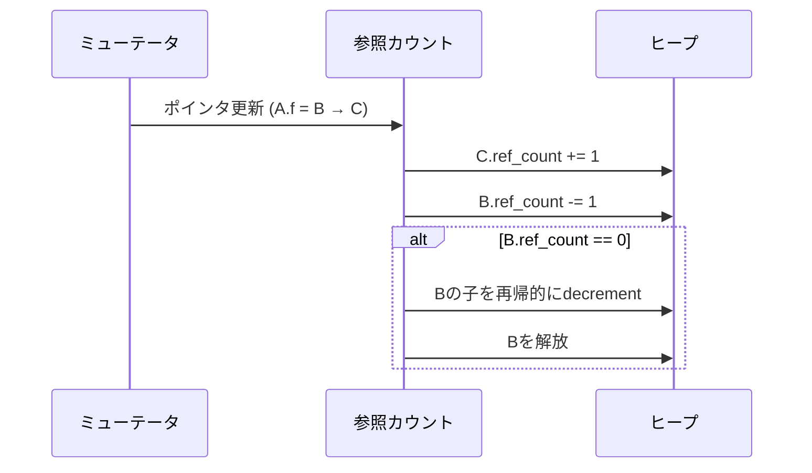
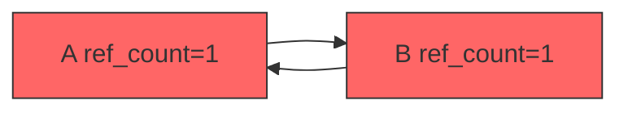

# 参照カウント

## 基本原理

[参照カウント](#index:参照カウント)（Reference Counting, RC）は、各オブジェクトが自身への参照数（参照カウント）を保持し、カウントがゼロになった時点で即座にメモリを回収する方式である。[Collins](#cite:collins1960)が1960年にMcCarthyのリスト処理の文脈で提案した。

トレーシングGCが「生きているオブジェクトを見つける」のに対し、参照カウントは「死んだオブジェクトを見つける」。[Bacon et al.](#cite:bacon2004)が示したように、この2つは本質的に双対の関係にある。

## 基本アルゴリズム

```ruby
class RefCountCollector
  def write_barrier(obj, field_index, new_value)
    old_value = obj.fields[field_index]

    # 新しい参照先のカウントを増加
    increment(new_value) if new_value

    # ポインタを更新
    obj.fields[field_index] = new_value

    # 古い参照先のカウントを減少
    decrement(old_value) if old_value
  end

  def increment(obj)
    obj.ref_count += 1
  end

  def decrement(obj)
    obj.ref_count -= 1
    if obj.ref_count == 0
      # 子オブジェクトのカウントも再帰的に減少
      obj.fields.each { |child| decrement(child) if child }
      free(obj)
    end
  end

  private

  def free(obj)
    # メモリを解放
    obj.fields = nil
  end
end
```



## 参照カウントの長所

参照カウントには、トレーシングGCにはない重要な利点がある。

1. **即時回収**: オブジェクトが不要になった瞬間にメモリが回収される
2. **停止時間なし**: Stop-the-Worldが基本的に不要
3. **局所性**: 参照カウントの更新は局所的な操作
4. **デストラクタとの親和性**: 解放タイミングが決定的で、RAIIパターンと相性が良い

主要な採用例として、CPython（サイクルコレクタとの併用）、Swift/Objective-C（ARC: Automatic Reference Counting、コンパイラがretain/releaseを自動挿入）、Perl、PHPがある。Rustの`Rc<T>`/`Arc<T>`もオプトインの参照カウント型として提供されている。

## 循環参照問題

参照カウントの最大の弱点は、[循環参照](#index:循環参照)を回収できないことである。

```ruby
# 循環参照の例
a = GCObject.new
b = GCObject.new
a.fields[0] = b   # b.ref_count = 1
b.fields[0] = a   # a.ref_count = 1

# a, b へのルートからの参照を切る
# a.ref_count = 1（bからの参照が残る）
# b.ref_count = 1（aからの参照が残る）
# → どちらもカウントが0にならず、回収されない！
```



## 循環参照の解決策

### Baconのサイクルコレクション

[Bacon and Rajan](#cite:bacon2001)は、参照カウントと組み合わせて使える効率的なサイクルコレクションアルゴリズムを提案した。基本的な考え方は、参照カウントがデクリメントされたがゼロにならなかったオブジェクトを「サイクル候補」として記録し、定期的に局所的なトレーシングを行うことである。

```ruby
class CycleCollector
  PURPLE = :purple  # サイクル候補
  GRAY   = :gray    # トライアル削除中
  WHITE  = :white   # サイクルの一部と判定
  BLACK  = :black   # 到達可能

  def initialize
    @candidates = []  # サイクル候補リスト
  end

  def decrement(obj)
    obj.ref_count -= 1
    if obj.ref_count == 0
      release(obj)
    else
      # カウントがゼロでないなら、サイクルの一部かもしれない
      mark_candidate(obj)
    end
  end

  def collect_cycles
    mark_roots       # Phase 1: 候補からトライアル削除
    scan_roots       # Phase 2: 本当にサイクルか判定
    collect_roots    # Phase 3: サイクルを回収
  end

  private

  def mark_roots
    @candidates.each do |obj|
      if obj.color == PURPLE
        mark_gray(obj)
      else
        @candidates.delete(obj)
      end
    end
  end

  def mark_gray(obj)
    return unless obj.color != GRAY
    obj.color = GRAY
    obj.fields.each do |child|
      next unless child
      child.ref_count -= 1  # トライアル削除
      mark_gray(child)
    end
  end

  def scan_roots
    @candidates.each { |obj| scan(obj) }
  end

  def scan(obj)
    return unless obj.color == GRAY
    if obj.ref_count > 0
      scan_black(obj)  # 外部から参照あり → 生存
    else
      obj.color = WHITE  # サイクルゴミ
      obj.fields.each { |child| scan(child) if child }
    end
  end
end
```

> [!WARNING]
> サイクルコレクションは、参照カウントの即時回収という利点を部分的に損なう。サイクルコレクションの頻度とコストは、アプリケーションの特性に大きく依存する。

### 弱参照

もう一つの一般的な解決策は[弱参照](#index:弱参照)（weak reference）の使用である。サイクルを構成する参照の一部を弱参照にすることで、参照カウントに影響を与えずに参照関係を維持できる。Swiftでは`weak`と`unowned`の2種類の弱参照を提供し、デリゲートパターンなどで循環参照を防ぐ慣習が確立している。Pythonの`weakref`モジュール、Objective-Cの`__weak`修飾子、JavaScriptの`WeakRef`、Rustの`Weak<T>`なども同様の目的で提供されている。

### 不変データ構造のサイクル

興味深い最新の研究として、[Leijen](#cite:leijen2024)は不変（deeply immutable）データ構造における循環参照の効率的な参照カウント手法を提案した。不変グラフの強連結成分（SCC）を1つの参照カウント単位として扱うことで、サイクルを含む不変データを効率的に管理できる。

## 参照カウントのオーバーヘッド

参照カウントの主なオーバーヘッドは以下の通りである。

1. **カウント操作**: ポインタの読み書きのたびにインクリメント/デクリメントが必要
2. **メモリ**: 各オブジェクトにカウンタフィールドが必要
3. **再帰的デクリメント**: 大きなデータ構造の解放時にスパイクが発生
4. **スレッド安全性**: マルチスレッド環境ではアトミック操作が必要

### 遅延参照カウント

カウント操作のオーバーヘッドを削減するために、**遅延参照カウント**（deferred reference counting）がよく使われる。スタックやレジスタからの参照はカウントに含めず、ヒープ間の参照のみをカウントする。CPythonが採用しているのはこの遅延参照カウントの一種であり、ローカル変数からの参照による頻繁なカウント操作を削減している。

```ruby
class DeferredRefCount
  def initialize
    @zero_count_table = []  # カウントが0だが、スタックから参照されているかもしれない
  end

  def decrement(obj)
    obj.ref_count -= 1
    if obj.ref_count == 0
      @zero_count_table.push(obj)  # 即座には解放しない
    end
  end

  def collect
    # ルートスキャンでスタックからの参照をチェック
    live_from_roots = scan_roots
    @zero_count_table.each do |obj|
      free(obj) unless live_from_roots.include?(obj)
    end
    @zero_count_table.clear
  end
end
```

### 合体参照カウント

**合体参照カウント**（coalesced reference counting）は、同一フィールドの複数回の更新を1回のカウント操作にまとめる最適化である。

## 現代の参照カウント: Perceus

[Reinking et al.](#cite:reinking2021)が提案した[Perceus](#index:Perceus)は、コンパイラが精密な参照カウント命令を挿入することで、（サイクルフリーな）プログラムにおいてガーベージフリーな実行を実現するシステムである。

Perceusの核心的なアイデアは以下の通りである。

1. **精密な挿入**: コンパイラが各変数の最終使用箇所を分析し、正確な位置にdrop（デクリメント）を挿入
2. **再利用分析**: 解放直後のメモリを新しいオブジェクトに再利用可能かを静的に判定
3. **借用**: 関数引数の参照カウント操作を省略する最適化

```ruby
# Perceusスタイルの参照カウント挿入（概念図）
# 元のコード:
#   def map(xs, f) = match xs
#     | Nil -> Nil
#     | Cons(x, xx) -> Cons(f(x), map(xx, f))

# RC命令挿入後:
def map(xs, f)
  case xs
  when Nil
    drop(f)       # fはここが最終使用
    return Nil
  when Cons
    x, xx = xs.head, xs.tail
    dup(f)         # fはmapでも使うのでdup
    new_head = f.call(x)  # xはここが最終使用
    new_tail = map(xx, f) # xx, fはここが最終使用
    # xsの解放されたメモリをConsの割り当てに再利用
    Cons.new(new_head, new_tail)
  end
end
```

[Lorenzen and Leijen](#cite:lorenzen2022)はフレーム制限付き再利用（Frame Limited Reuse）を提案し、さらに[Lorenzen et al.](#cite:lorenzen2023)はFP²（Fully in-Place Functional Programming）として、関数型プログラムにおけるin-place更新の保証を確立した。

> [!TIP]
> Perceusとその後続研究は、関数型言語[Koka](#index:Koka)の実装基盤となっている。参照カウントベースのメモリ管理が、コンパイラの静的解析と組み合わさることで、GCなしでも安全かつ高性能なメモリ管理が可能であることを示した画期的な成果である。同様のコンパイラ支援RCのアプローチは、Lobster言語やVale言語にも影響を与えている。SwiftのARCもコンパイラがretain/releaseを挿入する点でPerceusと共通する設計思想を持つが、Perceusはより精密な最終使用分析と再利用分析を行う点で先を行っている。
