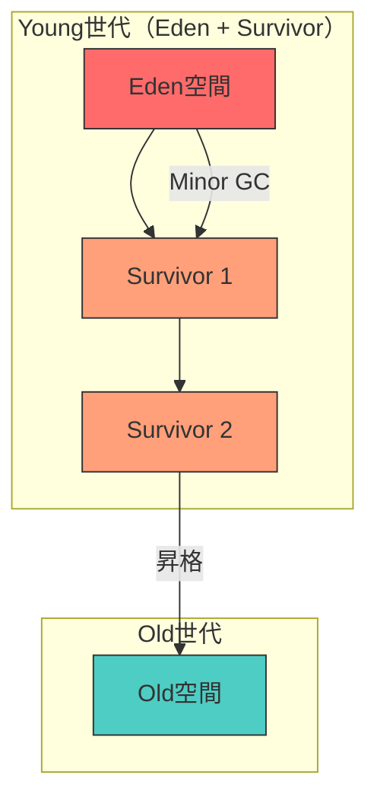
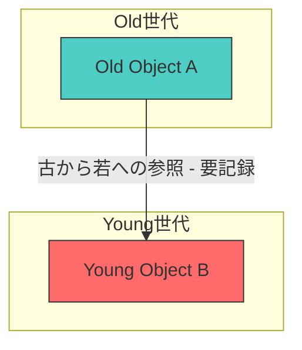

# 世代別GC

## 世代仮説

[世代別GC](#index:世代別GC)（Generational GC）の理論的根拠は、**世代仮説**（generational hypothesis）である。

> ほとんどのオブジェクトは若くして死ぬ（most objects die young）。

[Ungar](#cite:ungar1984)は1984年にSmalltalk-80の処理系において、世代別のスカベンジングアルゴリズムを提案し、この仮説に基づく効率的なGCが実現可能であることを示した。[Appel](#cite:appel1989)はML処理系で同様のアプローチを取り、バンプポインタによる高速な割り当てと世代別GCの組み合わせが非常に効果的であることを示した。



## 世代仮説の再考

世代仮説は長年自明のものとして受け入れられてきたが、[Dolan](#cite:dolan2025)は2025年のISMMにおいて、この仮説を厳密に再定式化した。従来の仮説は以下の問題を抱えていた。

1. GC戦略に依存しない形での定量的測定方法が不明確
2. 合成可能でない（複数のプログラムを組み合わせた場合の振る舞いが予測困難）
3. 世代別GCの有効性との直接的な結びつきが不明確

Dolanは**寿命分散**（lifetime dispersion）という指標を提案し、ジニ係数によってプログラムのオブジェクト寿命分布の偏りを定量化した。この指標は合成可能であり、世代別GCの有効性と直接結びつく。

## 基本構造

世代別GCは、ヒープを複数の世代（generation）に分割する。現在、ほとんどの主要処理系が世代別GCを採用している。HotSpot JVM（全GCが世代別）、.NET CLR（3世代）、V8（Young/Old）、CRuby 2.1以降、OCaml（マイナー/メジャーヒープ）、GHC（Haskell、世代別コピーGC）、LuaJITなどが代表的である。Go言語は例外的に非世代別GCを採用している（理由は[8. 主要処理系のGC実装](08-modern-implementations.md)を参照）。

```ruby
class GenerationalCollector
  def initialize(young_size, old_size)
    @young = SemiSpace.new(young_size)  # 若い世代（コピーGC）
    @old = MarkSweepSpace.new(old_size) # 古い世代（Mark-Sweep）
    @remembered_set = Set.new           # ライトバリアで記録
    @tenure_threshold = 2               # 昇格閾値（GC生存回数）
  end

  # 割り当ては常に若い世代から
  def allocate(size)
    obj = @young.allocate(size)
    unless obj
      minor_gc
      obj = @young.allocate(size)
      unless obj
        major_gc
        obj = @young.allocate(size)
        raise "OutOfMemory" unless obj
      end
    end
    obj
  end

  # マイナーGC: 若い世代のみ回収
  def minor_gc
    roots = global_roots + @remembered_set.to_a

    @young.objects.each do |obj|
      if reachable_from?(roots, obj)
        if obj.age >= @tenure_threshold
          promote(obj)     # 古い世代に昇格
        else
          obj.age += 1
          @young.copy_to_survivor(obj)
        end
      end
    end

    @young.flip  # from/toを入れ替え
  end

  # メジャーGC: 全世代を回収
  def major_gc
    full_mark_sweep(@young, @old)
  end

  private

  def promote(obj)
    new_location = @old.allocate(obj.size)
    copy(obj, new_location)
  end
end
```

## ライトバリア

世代別GCの鍵となる機構が[ライトバリア](#index:ライトバリア)（write barrier）である。古い世代から若い世代への参照を追跡しないと、マイナーGCで若い世代のオブジェクトが誤って回収される可能性がある。



### カードテーブル

最も一般的なライトバリアの実装が[カードテーブル](#index:カードテーブル)（card table）である。ヒープを固定サイズのカード（通常512バイト）に分割し、古い世代のカードにダーティビットを設定する。HotSpot JVMのParallel GCおよびG1 GC（リージョン内）、.NET CLRが代表的な採用例である。V8もカードマーキングの変種を使用している。

```ruby
class CardTable
  CARD_SIZE = 512

  def initialize(heap_size)
    @cards = Array.new(heap_size / CARD_SIZE, false)
  end

  # ライトバリア: 古い→若いへの参照を記録
  def write_barrier(src, field_index, new_ref)
    if old_generation?(src) && young_generation?(new_ref)
      card_index = address_of(src) / CARD_SIZE
      @cards[card_index] = true  # ダーティマーク
    end
    src.fields[field_index] = new_ref
  end

  # マイナーGC時: ダーティカード内のオブジェクトをスキャン
  def dirty_cards
    @cards.each_with_index
      .select { |dirty, _| dirty }
      .map { |_, index| index }
  end

  def clear
    @cards.fill(false)
  end
end
```

### リメンバードセット

もう一つの方式は[リメンバードセット](#index:リメンバードセット)（remembered set）で、世代間参照を持つオブジェクトそのもの（または参照元フィールド）を明示的に記録する。G1 GCはリメンバードセットをリージョン単位で管理しており、ZGCもGenerational ZGC（JDK 21+）でリメンバードセットを導入した。OCaml 5.0のマルチコアGCでは、ドメイン間参照の追跡にリメンバードセットを使用している。CRubyも世代別GCの実装にリメンバードセットを採用している。

```ruby
class RememberedSet
  def initialize
    @entries = Set.new
  end

  def write_barrier(src, field_index, new_ref)
    if different_generation?(src, new_ref)
      @entries.add([src, field_index])
    end
    src.fields[field_index] = new_ref
  end

  def scan_roots
    @entries.map { |src, idx| src.fields[idx] }.compact
  end
end
```

### ライトバリアのオーバーヘッドと実装の課題

ライトバリアはポインタ書き込みのたびに実行されるため、ミューテータの性能に直接影響する。[Hosking et al.](#cite:hosking1992)は、ライトバリアの実装方式を網羅的に比較し、方式によって実行時オーバーヘッドが1%から数十%まで大きく異なることを示した。

[Blackburn and McKinley](#cite:blackburn2002)は、ライトバリアの配置と実装がミューテータ性能に与える影響を詳細に分析した。彼らの研究では、インライン化されたバリアコードが分岐予測やキャッシュに悪影響を及ぼすことが明らかになった。特に以下の点が課題として挙げられている。

1. **コンパイラへの侵襲性**: ライトバリアのサポートはコンパイラの最適化パイプラインに深く組み込む必要がある。JITコンパイラではバリアコードの挿入がレジスタ割り当てやインライン化の判断に影響する
2. **条件分岐のコスト**: 世代チェック（古い→若いへの参照か？）の条件分岐はほとんどの場合不成立だが、分岐予測ミスのコストが無視できない
3. **キャッシュ汚染**: カードテーブルへの書き込みやリメンバードセットの更新が、ミューテータのワーキングセットとキャッシュラインを競合する
4. **言語処理系への統合**: C/C++拡張ライブラリやFFIを持つ言語では、ネイティブコードにもバリアを正しく挿入する必要があり、実装の複雑さが大幅に増す。[CRubyではC拡張がライトバリアを正しく呼ばないケースが長年の課題であった](#cite:wang2025ruby)

[Zorn](#cite:zorn1990)は、ソフトウェアバリアとハードウェア（仮想メモリ保護）バリアの比較を行い、ページ保護によるバリアはトラップのコストが高く、きめ細かい粒度の追跡が困難であることを示した。一方、ソフトウェアバリアは柔軟だが、すべてのポインタ書き込みにオーバーヘッドが生じる。

ライトバリアのコストを最小化するため、現代のGCでは様々な工夫がなされている。以下に代表的な最適化手法を、アルゴリズムとともに詳しく解説する。

#### 無条件カードマーキング

最もシンプルかつ高速なアプローチが、**世代チェックを省略する**無条件カードマーキングである。[Hosking et al.](#cite:hosking1992)の比較研究でも、条件分岐を除去した無条件バリアが最も低オーバーヘッドであることが示された。HotSpot JVMのParallel GCがこの方式を採用している。

```ruby
# 無条件カードマーキング: 分岐なし
def write_barrier_unconditional(src, field_index, new_ref)
  # 世代チェックなし - 常にカードをダーティにする
  card_index = address_of(src) >> CARD_SHIFT  # 除算の代わりにシフト
  @card_table[card_index] = DIRTY             # 1命令のストアのみ
  src.fields[field_index] = new_ref
end
```

このバリアは1回のストア命令で完了するため、分岐予測ミスが発生しない。代償として、同一世代内の参照更新でもカードがダーティになるため、マイナーGC時のスキャン対象が増える。しかし[Blackburn and McKinley](#cite:blackburn2002)は、この「偽陽性」のコストよりも条件分岐の除去で得られるミューテータ側の高速化が大きいケースが多いことを示した。

#### フィルタリング最適化

不要なバリア実行を**静的・動的に除去**する手法である。

**静的フィルタリング**では、コンパイラが参照書き込みの性質を分析し、バリアを省略する。例えば以下の場合にバリアは不要である。

1. **初期化ストア**: `new`直後のフィールド初期化は、オブジェクトが必ず若い世代にあるため、古い→若いの参照は発生しない
2. **NULLストア**: 参照をNULLにする場合、世代間参照は増えない
3. **イミュータブルフィールド**: 初期化後に変更されないフィールド（`final`など）

```ruby
# 静的フィルタリング: コンパイル時に不要なバリアを除去
def optimized_new(klass)
  obj = allocate_in_young(klass.instance_size)
  # 初期化ストアにはバリア不要（必ずYoung世代にある）
  klass.fields.each_with_index do |default_val, i|
    obj.fields[i] = default_val  # バリアなし！
  end
  obj
end
```

[Blackburn and McKinley](#cite:blackburn2002)は、JIT最適化パイプラインにおいてバリアのインライン化位置がレジスタ割り当てに影響を与えることを示し、**バリアコードをファストパス（インライン）とスローパス（アウトオブライン）に分離**する手法を提案した。

```ruby
# ファストパス/スローパス分離
def write_barrier_fast_slow(src, field_index, new_ref)
  src.fields[field_index] = new_ref
  # ファストパス: 1回の比較のみ（インライン展開）
  return if young_generation?(src)  # 若い世代なら即リターン
  # スローパス: 別関数に分離（コールドコード）
  write_barrier_slow(src, field_index, new_ref)
end

def write_barrier_slow(src, field_index, new_ref)
  return unless young_generation?(new_ref)
  card_index = address_of(src) >> CARD_SHIFT
  @card_table[card_index] = DIRTY
end
```

ファストパスでは若い世代のオブジェクト（大多数のケース）を1回の比較で除外し、スローパスのコードをアウトオブラインに配置することで、インライン化による命令キャッシュ汚染を防ぐ。

**動的フィルタリング**として、すでにダーティなカードへの重複書き込みを避ける方法もある。

```ruby
# ダーティカードフィルタ: 冗長な書き込みを回避
def write_barrier_filtered(src, field_index, new_ref)
  src.fields[field_index] = new_ref
  card_index = address_of(src) >> CARD_SHIFT
  # すでにダーティなら書き込みスキップ（キャッシュライン汚染を回避）
  if @card_table[card_index] != DIRTY
    @card_table[card_index] = DIRTY
  end
end
```

このフィルタは一見無駄な分岐に見えるが、カードテーブルへのストアがキャッシュラインを排他状態にする（MESIプロトコルのInvalidateが飛ぶ）マルチコア環境では、不要なストアの回避が性能向上に寄与する。HotSpot JVMでは`-XX:+UseCondCardMark`オプションでこのフィルタを有効化できる。

#### シーケンシャルストアバッファ（SSB）

[Appel](#cite:appel1989)が提案した方式では、バリア時にカードやリメンバードセットを直接更新するのではなく、ポインタ更新をバッファに記録し、GC時にまとめて処理する。

```ruby
class SequentialStoreBuffer
  def initialize(capacity)
    @buffer = Array.new(capacity)
    @cursor = 0
  end

  # ライトバリア: ストアアドレスをバッファに追記するだけ
  def write_barrier(src, field_index, new_ref)
    src.fields[field_index] = new_ref
    @buffer[@cursor] = [src, field_index]
    @cursor += 1
    flush if @cursor >= @buffer.size  # バッファが満杯なら処理
  end

  # GC時またはバッファ満杯時にまとめて処理
  def flush
    @buffer[0...@cursor].each do |src, field_index|
      ref = src.fields[field_index]
      # この時点で参照先が若い世代かを確認（遅延評価）
      if ref && old_generation?(src) && young_generation?(ref)
        @remembered_set.add(src)
      end
      # 参照がNULLや同世代に変わっていれば自動的にフィルタされる
    end
    @cursor = 0
  end
end
```

SSBの利点は、バリア自体がバッファへの追記（ポインタのストアとカーソルのインクリメント）のみで完了するため、**バリア時点での世代チェックが不要**になることである。さらに、flush時に参照先を再確認するため、バリア後にフィールドが上書きされた場合の冗長なエントリが自動的に除去される。G1 GCやZGCはこの方式の変種を採用している。

#### ページ保護による仮想メモリバリア

ハードウェア支援のアプローチとして、[Zorn](#cite:zorn1990)が比較評価したOSの仮想メモリ保護機構を利用する方法がある。古い世代のページを書き込み禁止にし、書き込み時のページフォルトをトラップとして捕捉する。

```ruby
# 仮想メモリ保護によるバリア（概念的な擬似コード）
class VirtualMemoryBarrier
  def protect_old_generation
    @old_pages.each do |page|
      mprotect(page, PROT_READ)  # 書き込み禁止
    end
  end

  # ページフォルトハンドラ（OSシグナル経由で呼ばれる）
  def handle_page_fault(faulting_address)
    page = page_of(faulting_address)
    @dirty_pages.add(page)
    mprotect(page, PROT_READ | PROT_WRITE)  # 書き込み許可
    # ミューテータに制御を返し、元の書き込みを再実行
  end

  # マイナーGC時: ダーティページのみスキャン
  def scan_dirty_pages
    @dirty_pages.each do |page|
      scan_page_for_young_references(page)
    end
  end
end
```

この方式はミューテータコードにバリアを挿入する必要がないため、既存のコンパイラを修正せずに利用できるという利点がある。しかしZornの評価では、ページフォルトのトラップコスト（数千サイクル）が高く、ページ粒度（通常4KB）でしか追跡できないため、カードテーブル（512バイト粒度）より大幅に多くのオブジェクトをスキャンする必要がある。結論として、ソフトウェアバリアの方が実用的である場合が多いが、[Bartlett](#cite:bartlett1989)のMostly-Copying GCのように、保守的GCとの組み合わせで仮想メモリバリアが有効なケースもある。

#### 複数手法の組み合わせ

現代の高性能GCは、これらの最適化を組み合わせて使用している。

| 処理系 | バリア方式 | 主な最適化 |
|--------|-----------|-----------|
| HotSpot Parallel GC | 無条件カードマーキング | ストア1命令のみ、条件付きカードマーク(`UseCondCardMark`)オプション |
| HotSpot G1 GC | カード＋リメンバードセット＋SSB | バッファリングによる遅延処理、リファインメントスレッドでの並行処理 |
| ZGC (JDK 21+) | ストアバッファ＋リメンバードセット | 世代別化に伴い導入、カラーポインタとの統合 |
| .NET CLR | カードテーブル | JITによる静的フィルタリング、初期化ストアのバリア省略 |
| OCaml 5.0 | リメンバードセット | マイナーヒープへの参照のみ記録、ドメインローカルバッファ |
| CRuby | リメンバードセット | C拡張API (`RB_OBJ_WRITE`)による明示的バリア |

> [!IMPORTANT]
> ライトバリアの選択はGC全体の設計に波及する。Go言語がライトバリアのコストを嫌って非世代別GCを採用していることは、このオーバーヘッドの深刻さを示す一例である（ただし、将来的に世代別GCの導入も検討されている）。バリアの最適化は、コンパイラ、ランタイム、ハードウェアの全レベルで協調して初めて最大の効果を発揮する。

## 昇格ポリシー

オブジェクトを古い世代に昇格させるタイミングは、GCの性能に大きく影響する。

**即時昇格**（immediate tenuring）: 1回のマイナーGCを生き延びたら昇格。シンプルだが、一時的に長生きするオブジェクトが古い世代を汚染する。

**遅延昇格**（delayed tenuring）: 複数回のマイナーGCを生き延びた場合に昇格。より精密だが、若い世代にコピーGC（セミスペース方式）を用いる場合はSurvivor空間間のコピーコストが増える。

**動的閾値**: ヒープの利用状況に応じて昇格閾値を動的に調整する。HotSpot JVMのAdaptive Size Policyがこの例である。

## 世代数

2世代が最も一般的だが、理論的にはN世代のGCも可能である。

```ruby
class MultiGenerationalGC
  def initialize(num_generations, sizes)
    @generations = sizes.map { |s| Generation.new(s) }
    @num_generations = num_generations
  end

  # 世代nのGC: 世代0..nを対象
  def collect(n)
    roots = global_roots
    # 世代n+1以降からの参照を追加
    (n + 1...@num_generations).each do |i|
      roots += @generations[i].remembered_set
    end

    # 世代0..nの生存オブジェクトを処理
    (0..n).each do |i|
      @generations[i].objects.each do |obj|
        if reachable_from?(roots, obj)
          if i < n
            promote_to(obj, i + 1)  # 次の世代に昇格
          else
            # 最も古い対象世代ではそのまま保持
          end
        end
      end
    end
  end
end
```

世代数の選択はGC設計における重要な問題である。[Ungar](#cite:ungar1984)の原論文では2世代（New/Old）を用い、[Appel](#cite:appel1989)も2世代の単純な構成で十分な効果が得られることを示した。[Jones et al.](#cite:jones2023)は、世代数を増やすとライトバリアの管理対象が増加し、世代間の昇格ポリシーの組み合わせが複雑化するため、実用上は2世代が最も費用対効果が高いと結論づけている。

一方、3世代以上を採用する処理系も存在する。.NET CLRは3世代（Gen0、Gen1、Gen2）を持ち、Gen0からGen1への昇格で「中程度の寿命」のオブジェクトをフィルタリングし、長寿命オブジェクトのみがGen2に到達する設計としている。OCamlのGCはマイナーヒープ（コピーGC）とメジャーヒープ（インクリメンタルMark-Sweep）の2世代に加え、メジャーヒープに対する[コンパクション](#index:コンパクション)フェーズを持ち、実質的に3段階の管理を行っている。GHC（Haskell）はデフォルトで2世代だが、`+RTS -G`オプションで世代数を変更できる。[Marlow et al.](#cite:marlow2008)はGHCの並列世代別コピーGCの評価において、世代数やステップ数を増やしてもベンチマークでは効果が見られなかったと報告している（ただし長時間実行プログラムでは有益な場合があるとも述べている）。

理論的には、世代数を$n$とすると、世代$i$のGC頻度は世代$i-1$より低くなるため、各世代が寿命分布の異なる「バケツ」として機能する。しかし世代数$n$に対してライトバリアが管理すべき世代間参照の方向は最大$O(n^2)$となり、この管理コストが追加世代による回収効率の改善を上回る点が、2世代が最適となる主な理由である。
