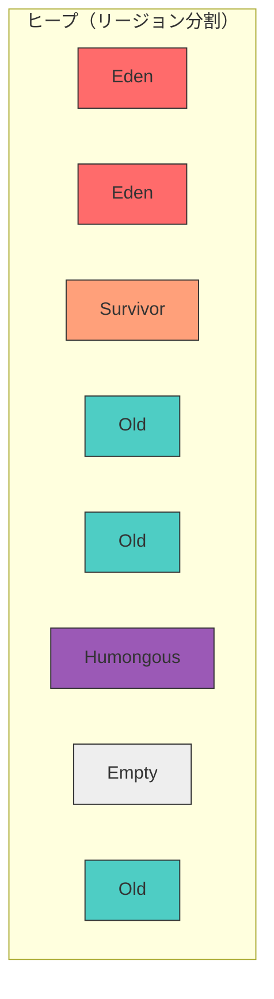
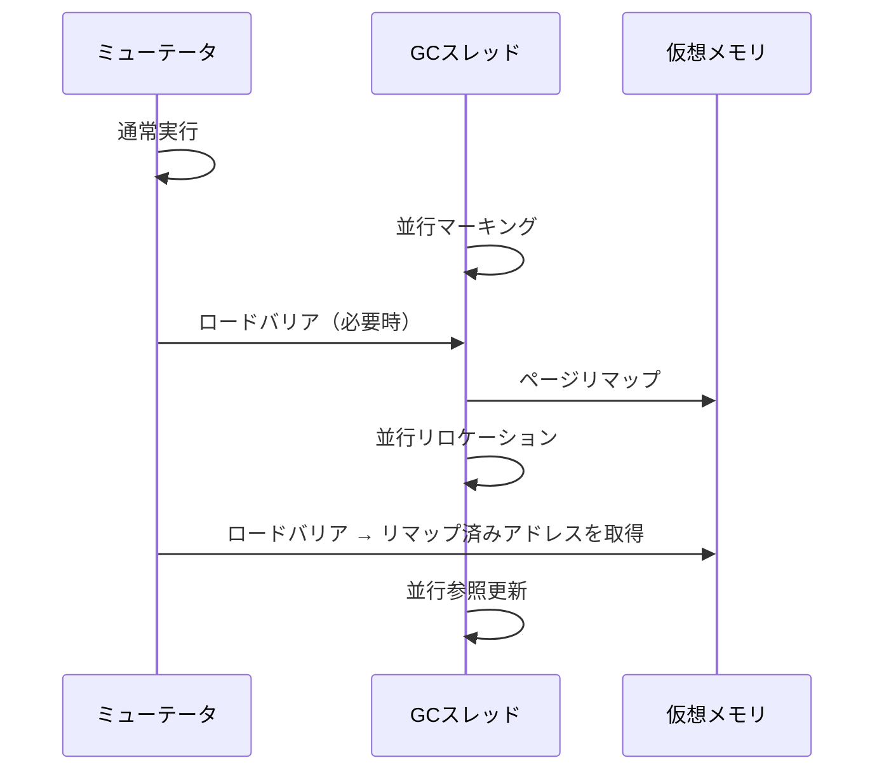

# 並行・並列GC

## 用語の整理

まず、GCにおける[並行](#index:並行GC)（concurrent）と[並列](#index:並列GC)（parallel）の違いを明確にする。

- **並列GC**: 複数のGCスレッドが協力してGC処理を行う。ミューテータは停止している。
- **並行GC**: GCスレッドがミューテータと同時に動作する。ミューテータの停止時間を最小化する。
- **増分GC**: GC処理を小さなステップに分割し、ミューテータと交互に実行する。

```
時間 →

Stop-the-World GC:
  ミューテータ  |████████|        |████████|
  GCスレッド    |        |■■■■■■■■|        |
                         ↑停止    ↑再開

並列GC:
  ミューテータ  |████████|    |████████████████|
  GCスレッド1   |        |■■■■|                |
  GCスレッド2   |        |■■■■|                |
                         ↑停止↑再開（複数スレッドで高速化）

並行GC:
  ミューテータ  |████████████████████████████████|  ← 停止しない
  GCスレッド    |        |■■■■■■■■■■■■■■|        |  ← 裏で同時実行
```

## セーフポイントとミューテータの停止

「Stop-the-World（STW）でミューテータを停止する」と簡単に言うが、*どうやって*動作中のスレッド群を安全に止めるのか、という実装上の根本問題がある。OSのシグナルでスレッドを任意の瞬間に凍結するだけでは不十分である。ちょうどオブジェクトの割り当ての途中だったり、レジスタに参照を載せ替えている最中だったりすると、ヒープやスタックが一時的に不整合な状態になっており、その瞬間にGCがルートを走査すると[第2章](02-tracing.md)で述べたスタックマップが正確でなく、参照を取りこぼしかねない。

そこで導入されるのが[セーフポイント](#index:セーフポイント)（safepoint）である。セーフポイントとは、「ヒープとスタックの状態が整合しており、スタックマップが正確で、GCが安全にルートを走査できるプログラム地点」のことである。ミューテータを止めるとは、正確には「すべてのスレッドを次のセーフポイントまで進めてから止める」ことを意味する。

### セーフポイントの実現方法

コンパイラは、メソッドの入り口やループのバックエッジ（繰り返しの先頭に戻る箇所）など、一定間隔ごとにセーフポイントを埋め込む。各スレッドはセーフポイントで「いまGCが停止を要求していないか」をチェックし、要求されていれば自発的に停止する。このチェックを安価にする代表的な実装が**ポーリング**である。

```ruby
# セーフポイント・ポーリングの概念
class SafepointPoll
  def initialize
    @safepoint_requested = false
  end

  # コンパイラがループや関数境界に挿入するチェック
  def poll
    if @safepoint_requested
      # 自分のスタックはいま正確 → GCに「停止しました」と通知して待つ
      block_until_resumed
    end
  end
end
```

HotSpot JVMは、この「チェック」をさらに巧妙に実装している。専用の番兵ページ（polling page）への読み込み命令を1つ置いておき、GCが停止を要求するときはそのページを「アクセス不可」に設定する。すると次にそのページを読んだスレッドはページフォルトを起こし、シグナルハンドラ経由でセーフポイントに入る。平常時は単なるメモリ読み込み1命令なので、オーバーヘッドはほぼゼロである。

### グローバルSTWからスレッドローカル・ハンドシェイクへ

従来のセーフポイントは「全スレッドを一斉に止める」グローバルなものだった。しかし、わずかなルートスキャンのために全スレッドを待ち合わせるのは、停止時間の観点で無駄が大きい。そこで現代のJVM（JDK 10以降）は[スレッドローカル・ハンドシェイク](#index:スレッドローカル・ハンドシェイク)（thread-local handshake）を導入した。これは、全体を止めずに**スレッドごとに個別**にセーフポイント動作（自身のスタックスキャンなど）を実行させる仕組みである。ZGCやShenandoahのような並行GCが、ルートスキャンすらほぼ止めずに行えるのは、この細粒度の停止機構に支えられている。

セーフポイントは、並行GCのバリア（次節）と並んで、「ミューテータとGCがどう協調するか」というGC実装の核心をなす。停止時間の問題は、回収アルゴリズムだけでなく、この停止機構の設計にも左右される。

## 並行GCの理論的基盤

### 三色不変条件とバリア

並行GCの正しさは、[Dijkstra et al.](#cite:dijkstra1978)が提案した三色不変条件に基づく。ミューテータとGCが同時に動作する場合、ミューテータがオブジェクトグラフを変更することで、GCが到達可能なオブジェクトを見逃す危険がある。

具体的には、以下の条件が同時に成立するとオブジェクトが失われる。

1. ミューテータが黒いオブジェクトから白いオブジェクトへの参照を追加
2. 灰色オブジェクトから同じ白いオブジェクトへの参照が（GCが走査する前に）削除

この問題を防ぐために2種類のバリアが使われる。

**インクリメンタル・アップデート**（incremental update）: 黒→白の参照追加を検知し、参照先を灰色にする（[Steele](#cite:steele1975)のライトバリア）。Go言語のGCがDijkstra方式のインクリメンタル・アップデートバリアを採用している。CRubyのインクリメンタルマーキング（Ruby 2.2+）もこの方式を使用する。

```ruby
class IncrementalUpdateBarrier
  def write_barrier(src, field_index, new_ref)
    if src.color == :black && new_ref&.color == :white
      new_ref.color = :gray
      @gc.worklist.push(new_ref)
    end
    src.fields[field_index] = new_ref
  end
end
```

**SATB（Snapshot-At-The-Beginning）**: マーク開始時のオブジェクトグラフのスナップショットに基づいて到達可能性を判定する。参照が切断される前の値を記録する。HotSpot JVMのG1 GC、Shenandoah、およびZGCがSATBバリアを採用している。

```ruby
class SATBBarrier
  def write_barrier(src, field_index, new_ref)
    old_ref = src.fields[field_index]
    if @gc.marking? && old_ref && old_ref.color == :white
      old_ref.color = :gray
      @gc.worklist.push(old_ref)
    end
    src.fields[field_index] = new_ref
  end
end
```

> [!IMPORTANT]
> SATBバリアはマーク開始時のスナップショットに基づくため、マーク中に新たに到達不可能になったオブジェクトがGCサイクルで回収されない（floating garbage）場合がある。これは正しさの問題ではなく、完全性の妥協である。

## Bakerのリアルタイムコピー

[Baker](#cite:baker1978)は、ミューテータとGCが交互に動作するインクリメンタルなコピーGCを提案した。ミューテータがオブジェクトにアクセスする際、そのオブジェクトがまだfrom-spaceにある場合はto-spaceにコピーしてからアクセスする（リードバリア）。Bakerのアルゴリズムを直接採用した処理系は少ないが、リードバリアの概念は後のShenandoah（Brooksポインタ）やZGC（ロードバリア）に大きな影響を与えた。Erlang VMの初期のGC設計にも影響を与えている。

```ruby
class BakerCollector
  def read_barrier(ref)
    if in_from_space?(ref)
      new_ref = copy_to_to_space(ref)
      return new_ref
    end
    ref
  end

  # ミューテータの割り当てごとに一定量のGC作業を行う
  def allocate(size)
    # GC作業を少し進める
    scan_increment(WORK_PER_ALLOC)

    obj = @to_space.bump_allocate(size)
    unless obj
      flip  # GCサイクル完了
      obj = @to_space.bump_allocate(size)
    end
    obj
  end
end
```

## 現代の低レイテンシGC

### G1 GC

[Garbage-First（G1）GC](#index:G1 GC)は[Detlefs et al.](#cite:detlefs2004)が提案した、リージョンベースの世代別並行GCである。JDK 9以降、HotSpot JVMのデフォルトGCとなっている。

G1の特徴:
- ヒープを等サイズのリージョンに分割
- 各リージョンはEden/Survivor/Old/Humongousのいずれかの役割を持つ
- ゴミの多いリージョンを優先的に回収（Garbage-First）
- 並行マーキングとイバキュエーション（退避）の組み合わせ



### Shenandoah

[Shenandoah](#index:Shenandoah)は[Flood et al.](#cite:flood2016)が開発した、OpenJDK向けの並行コンパクションGCである。オブジェクトの移動とミューテータのアクセスを並行に行うことで、ヒープサイズに依存しない短い停止時間を実現する。

初期のShenandoah（OpenJDK 12以前）は、各オブジェクトの先頭に間接参照ポインタ（[Brooks pointer](#index:Brooks Pointer)）を1ワード追加し、すべてのアクセスをこのポインタ経由で行うことで移動を実現していた。

```ruby
class BrooksPointer
  attr_accessor :forwarding

  def initialize(obj)
    @forwarding = obj  # 初期状態では自分自身を指す
  end

  # リードバリア: 常にforwardingを介してアクセス
  def read(obj)
    obj.forwarding  # 移動済みなら新しい位置を返す
  end
end
```

しかしBrooks pointer方式は、すべてのフィールドアクセスに間接参照のコストを課し、オブジェクトごとに1ワードのメモリオーバーヘッドを生む欠点があった。そのためJDK 13以降のShenandoahは、ヒープから参照を読み込んだ時点でのみ転送先を解決する**ロードリファレンスバリア（LRB）**へ移行し、転送ポインタワードも廃止した（詳細は[第8章](08-modern-implementations.md)）。

Shenandoahの並行コンパクションのフェーズ:
1. **並行マーク**: SATBバリアを使って並行にマーキング
2. **イバキュエーション**: オブジェクトを新リージョンにコピーし、転送情報を更新
3. **参照更新**: 古いポインタを新しいアドレスに書き換える（LRBが読み込み時に随時解決する）

### ZGC

[ZGC](#index:ZGC)は[Yang and Wrigstad](#cite:yang2022)が詳細に記述した、OpenJDKの超低レイテンシGCである。カラードポインタ（colored pointer）とロードバリアを活用して、ほぼ全てのGC作業を並行に行う。

ZGCの核心は、ポインタの未使用ビットにメタデータを埋め込む[カラードポインタ](#index:カラードポインタ)である。

```ruby
class ColoredPointer
  # 64ビットポインタのレイアウト（ZGC）
  # [63:46] 未使用
  # [45:42] メタデータビット（Marked0, Marked1, Remapped, Finalizable）
  # [41:0]  オブジェクトアドレス（最大4TB）

  MARKED0     = 1 << 42
  MARKED1     = 1 << 43
  REMAPPED    = 1 << 44
  FINALIZABLE = 1 << 45

  def self.address(ptr)
    ptr & 0x3FFFFFFFFFF  # 下位42ビット
  end

  def self.marked?(ptr, phase)
    mask = phase.even? ? MARKED0 : MARKED1
    (ptr & mask) != 0
  end

  def self.remap(ptr, new_address)
    (ptr & ~0x3FFFFFFFFFF) | REMAPPED | new_address
  end
end
```

ZGCのロードバリア:

```ruby
class ZGCLoadBarrier
  def load(field_addr)
    ref = read_memory(field_addr)
    if bad_color?(ref)
      # スロウパス: ポインタを修正
      ref = heal(ref)
      write_memory(field_addr, ref)  # 自己修復
    end
    ref
  end

  private

  def bad_color?(ref)
    !ColoredPointer.marked?(ref, @current_phase)
  end

  def heal(ref)
    addr = ColoredPointer.address(ref)
    if relocated?(addr)
      new_addr = forwarding_table[addr]
      ColoredPointer.remap(ref, new_addr)
    else
      mark(ref)
    end
  end
end
```

> [!TIP]
> ZGCはJDK 21で世代別対応（Generational ZGC）が導入され、スループットが大幅に改善された。若い世代の頻繁な回収と、古い世代の並行回収を組み合わせることで、低レイテンシとスループットの両立が進んでいる。

## Pauseless GCとC4

[Click, Tene, Wolf](#cite:click2005)が提案した[Pauseless GC](#index:Pauseless GC)は、完全に並行なGCアルゴリズムの先駆的な研究である。Azul SystemsのVega プロセッサ上で実装され、ハードウェアのリードバリア支援を活用した。

その後継である[C4（Continuously Concurrent Compacting Collector）](#cite:tene2011)は、汎用x86ハードウェア上でPauseless GCのアイデアを実現した。仮想メモリのリマッピングを活用して、大規模ヒープ（数百GB）でもサブミリ秒のポーズ時間を達成する。



## ハードリアルタイムGC: Metronome

これまでの低レイテンシGCは「停止時間をできるだけ短く」を目指していたが、組み込み制御や金融取引、航空宇宙といった分野では、「停止時間が決して一定の上限を超えない」という**ハードリアルタイム保証**が求められる。平均が速いだけでなく、最悪値が保証されていなければならない。

[Bacon, Cheng, Rajan](#cite:bacon2003)が提案した[Metronome](#index:Metronome)は、この保証を与えた画期的なリアルタイムGCである。Metronomeの鍵は、GC作業を時間ベースでスケジューリングする点にある。

- **時間ベースのスケジューリング**: 「割り当てをきっかけにGC作業を進める（work-based）」のではなく、ミューテータとGCを固定の時間スライス（例: 10 msのうちGCに最大3 ms）で交互に走らせる。これにより、ミューテータがある一定割合の時間を必ず確保できることが保証される。
- **最小ミューテータ稼働率（Minimum Mutator Utilization, MMU）**: 「任意の時間窓のうち、ミューテータが動ける時間の割合の下限」という指標を導入し、リアルタイム性を定量的に保証・検証できるようにした。
- **主に非移動・部分的デフラグ**: 通常は移動しないMark-Sweepで動作し、断片化が深刻なときだけ限定的にオブジェクトを移動する。移動コストの予測可能性を保つための設計である。

Metronomeの貢献は、GCを「いつ終わるか分からない処理」から「時間予算の中で計画的に進める処理」へと捉え直した点にある。この時間ベース・スケジューリングの考え方は、後のリアルタイムJava（RTSJ）実装や、停止時間に上限目標を設けるG1の`MaxGCPauseMillis`の発想にも通じている。

## 並行GCの設計トレードオフ

| 方式 | 最大停止時間 | スループット | 実装複雑度 | バリアコスト | 採用処理系 |
|------|-------------|-------------|-----------|-------------|-----------|
| G1 | 数ms〜数十ms | 高 | 中 | ライトバリア | HotSpot JVM（JDK 9+デフォルト） |
| Shenandoah | <1ms | 中 | 高 | リード+ライト | OpenJDK（Red Hat主導） |
| ZGC | <1ms | 中〜高 | 非常に高 | ロードバリア | OpenJDK（Oracle主導、JDK 15+） |
| C4 | <1ms | 中 | 非常に高 | ロードバリア | Azul Zing / Zulu Prime JVM |

> [!CAUTION]
> 並行GCは、ミューテータとGCの相互作用が複雑であるため、正しさの検証が非常に困難である。[Yang and Wrigstad](#cite:yang2022)はZGCの並行動作をSPINモデルとして定式化し、ミューテータとGCスレッド間の競合の解析に役立てている。このような形式的手法の適用は今後さらに重要になると考えられる（[第9章](09-latest-research.md)参照）。

## 分散GC

ここまでは1台のマシン・1つのアドレス空間の中でのGCを論じてきた。しかし、オブジェクトが複数のプロセスやマシンにまたがって参照し合う**分散システム**（Java RMI、Erlangのノード間通信、分散オブジェクトストアなど）では、GCはさらに難しい問題になる。[Plainfossé and Shapiro](#cite:plainfosse1995)の古典的サーベイが、この分野の技術を体系的に整理している。

分散GCが単一マシンのGCと根本的に異なるのは、次の点である。

- **グローバルなルート走査ができない**: 全マシンを同時に止めて一貫したスナップショットを取ることは、現実的には不可能（あるいは法外に高価）である。
- **メッセージの遅延・欠落・順序入れ替え**: 「参照を渡した」というメッセージと「参照を捨てた」というメッセージが入れ替わると、生きているオブジェクトを誤って回収しかねない。
- **部分故障**: あるマシンがクラッシュしても、残りは動き続けねばならない。

実用的な分散GCの多くは、トレーシングではなく**分散参照カウント**を基礎とする。各オブジェクトについて「どの遠隔ノードから参照されているか」を管理し、参照が増減するたびにメッセージで通知する。素朴な実装は前述のメッセージ競合に弱いため、以下の工夫が知られている。

- **重み付き参照カウント（weighted reference counting）**: 参照を複製するときにカウントを増やすのではなく、持っている「重み」を分割して渡す。これにより、複製時にオブジェクト本体へ増加メッセージを送る必要がなくなり、競合の一因を排除できる。
- **参照リスティング（reference listing）**: 単なる数ではなく「参照元ノードの集合」を保持する。これにより、ノード故障時にそのノード分の参照だけを安全に取り消せる。

一方で、参照カウントベースの分散GCは（単一マシンと同様に）ノードをまたぐ循環参照を回収できない。この弱点を補うため、ローカルなトレーシングGCと分散参照カウントを組み合わせるハイブリッド構成が一般的である。Erlangが「プロセスごとに独立した小さなヒープを持ち、プロセス間ではメッセージのコピーで参照共有を避ける」という設計を採るのは、そもそも分散GCの難問を回避する現実的な工夫だと見ることもできる。
