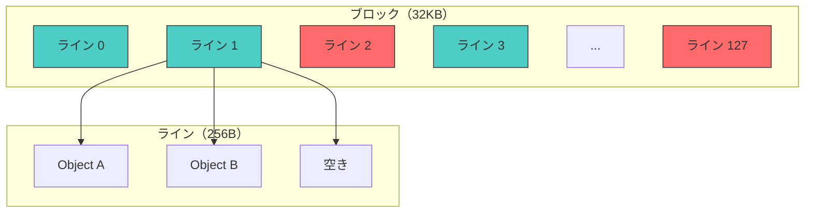
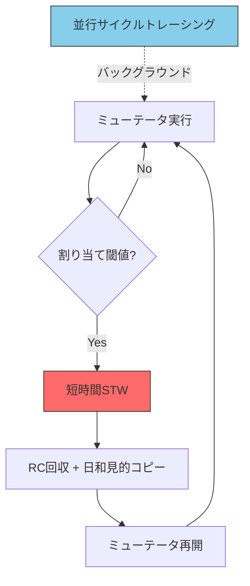

# リージョンベースGC

## リージョンベースメモリ管理の概要

[リージョンベース](#index:リージョンベース)のメモリ管理は、オブジェクトを論理的な領域（リージョン）にグループ化し、リージョン単位でメモリを管理する手法である。GCの文脈では、ヒープをリージョンに分割し、リージョン単位で回収の優先度を決定するアプローチが広く採用されている。

リージョンベースの手法には2つの系譜がある。

1. **静的リージョン推論**: コンパイル時にオブジェクトの所属リージョンを決定し、リージョンのスコープ終了時に一括解放する。MLKitやCycloneがこの系譜に属する。
2. **動的リージョンGC**: 実行時にリージョンの活性度を判定し、ゴミの多いリージョンを優先的に回収する。G1 GCやImmixがこの系譜に属する。

本章では後者を中心に扱う。

## Immix: Mark-Region方式

### 設計思想

[Immix](#index:Immix)は[Blackburn and McKinley](#cite:blackburn2008)が2008年に提案したMark-Region方式のGCである。Mark-SweepとコピーGCの長所を組み合わせた画期的な設計であり、その後のGC研究に大きな影響を与えた。

Immixの核心的なアイデアは、ヒープを**ブロック**（通常32KB）と**ライン**（通常256バイト）の二階層に分割することである。



### マーキングと回収

Immixのマーキングは、オブジェクト単位ではなくライン単位で行われる。生存オブジェクトを含むラインはマークされ、全てのオブジェクトが死んだラインは即座に再利用可能となる。

```ruby
class ImmixCollector
  BLOCK_SIZE = 32 * 1024  # 32KB
  LINE_SIZE  = 256        # 256B
  LINES_PER_BLOCK = BLOCK_SIZE / LINE_SIZE  # 128

  class Block
    attr_accessor :line_marks, :hole_count

    def initialize
      @line_marks = Array.new(LINES_PER_BLOCK, false)
      @hole_count = 0
    end

    # 使用可能な連続ホール（未マークのライン列）を探す
    def find_holes
      holes = []
      start = nil
      @line_marks.each_with_index do |marked, i|
        if !marked
          start ||= i
        elsif start
          holes << (start...i)
          start = nil
        end
      end
      holes << (start...LINES_PER_BLOCK) if start
      holes
    end
  end

  def mark(obj)
    return if obj.marked
    obj.marked = true
    # オブジェクトが占めるラインをマーク
    line_index = obj.address / LINE_SIZE % LINES_PER_BLOCK
    obj.block.line_marks[line_index] = true
  end

  def sweep
    @blocks.each do |block|
      recyclable = block.line_marks.count(false)
      if recyclable == LINES_PER_BLOCK
        # ブロック全体が空 → フリーリストへ
        @free_blocks.push(block)
      elsif recyclable > 0
        # 部分的に空 → リサイクル可能ブロック
        @recyclable_blocks.push(block)
      end
      # else: 完全に使用中 → そのまま
    end
  end
end
```

### 日和見的退避

Immixの重要な特徴の一つが**日和見的退避**（opportunistic defragmentation）である。通常のGCはMark（非移動）で行うが、フラグメンテーションが深刻な場合にのみ、一部のオブジェクトをコピーしてコンパクションする。

```ruby
class ImmixDefrag
  DEFRAG_THRESHOLD = 0.5  # ホール率がこれ以上のブロックをデフラグ対象に

  def should_defrag?(block)
    hole_ratio = block.line_marks.count(false).to_f / LINES_PER_BLOCK
    hole_ratio > DEFRAG_THRESHOLD
  end

  def collect_with_defrag
    # Phase 1: マーク
    mark_phase

    # Phase 2: デフラグ対象ブロックを選択
    defrag_blocks = @blocks.select { |b| should_defrag?(b) }

    # Phase 3: デフラグ対象のオブジェクトをコピー
    defrag_blocks.each do |block|
      block.live_objects.each do |obj|
        new_location = allocate_in_clean_block(obj.size)
        copy(obj, new_location)
        obj.forwarding = new_location
      end
    end

    # Phase 4: 通常のスイープ
    sweep_phase
  end
end
```

> [!NOTE]
> Immixの日和見的退避は、Mark-SweepとコピーGCの「いいとこ取り」を実現する。通常はMark-Sweepの低コストで動作し、フラグメンテーションが問題になった場合のみコピーを行う。[Blackburn and McKinley](#cite:blackburn2008)の評価では、20のベンチマークで既存のアルゴリズムに対して平均7〜25%の性能向上を示した。ImmixはMMTkフレームワーク上で実装されており、MMTk経由でCRuby（実験的）やJulia（開発中）でも利用可能になりつつある。また、Rustコンパイラ自身もGCを使わないが、Immixの設計思想はRust向けGCライブラリの研究にも影響を与えている。

## LXR: 次世代のリージョンベースGC

### 設計

[LXR（Latency-critical Immix with Reference counting）](#index:LXR)は[Zhao, Blackburn, McKinley](#cite:zhao2022)が2022年のPLDIで発表した、Immixの設計を基盤とする次世代GCである。低レイテンシと高スループットの両立を目指す。

LXRの核心的な設計判断:
1. **参照カウント + Immixヒープ**: ライン単位の参照カウントにより、多くのメモリをコピーなしで回収
2. **短時間STW回収**: 定期的な短いSTWで参照カウントベースの回収を行う
3. **並行サイクルトレーシング**: サイクルゴミの検出は並行に実施



### 性能

LXRの論文で報告された性能は驚異的である。

- タイトなヒープでLucene検索エンジンにおいて、Shenandoahに対して7.8倍のスループットと10倍の99.99パーセンタイルレイテンシの改善
- 17の多様なワークロードにおいて、G1に対してスループットで4%、Shenandoahに対して43%の改善

> [!TIP]
> LXRの設計哲学は「定期的な短いSTWは、並行イバキュエーションよりも効率的で十分なレスポンシブネスを提供する」というものである。これは、並行GCの常識に挑戦する主張であり、「STWは悪」という単純な二分法を超えた設計空間の探索を示唆している。

## リージョンベース設計のメリット

リージョンベースのヒープ構造は、以下の利点を提供する。

1. **空間効率**: ライン/リージョン単位の回収により、個別オブジェクトのフリーリスト管理が不要
2. **高速割り当て**: リージョン内でバンプポインタ割り当てが使える
3. **柔軟なポリシー**: リージョンごとに異なるGC戦略を適用可能
4. **並列性**: リージョン単位の独立した処理が容易
5. **局所性**: 同時に割り当てられたオブジェクトは同じリージョン内に配置される

```ruby
class RegionAllocator
  def initialize(region_size)
    @region_size = region_size
    @current_region = allocate_region
    @bump_pointer = 0
  end

  # バンプポインタ割り当て（非常に高速）
  def allocate(size)
    if @bump_pointer + size > @region_size
      @current_region = allocate_region
      @bump_pointer = 0
    end

    addr = @current_region.start + @bump_pointer
    @bump_pointer += size
    addr
  end
end
```

## G1との比較

ImmixとG1はどちらもリージョンベースだが、設計哲学が異なる。

| 特性 | G1 | Immix/LXR |
|------|-----|-----------|
| リージョンサイズ | 固定（1〜32MB） | ブロック32KB + ライン256B |
| 回収単位 | リージョン全体 | ライン（部分回収可能） |
| 移動方式 | イバキュエーション（必須） | 日和見的コピー |
| 世代管理 | 論理的世代 | LXRでは参照カウント |
| 並行性 | 並行マーク + STWイバキュエーション | STW RC + 並行サイクルトレース |

G1はリージョン全体を回収対象とするため、リージョン内に少数の生存オブジェクトがあるだけで効率が下がる。一方、Immixのライン単位の管理はより細粒度であり、部分的に使用中のブロックも再利用できる。
