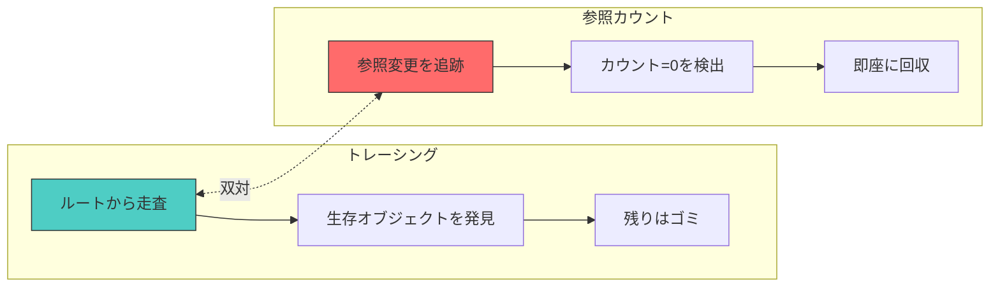
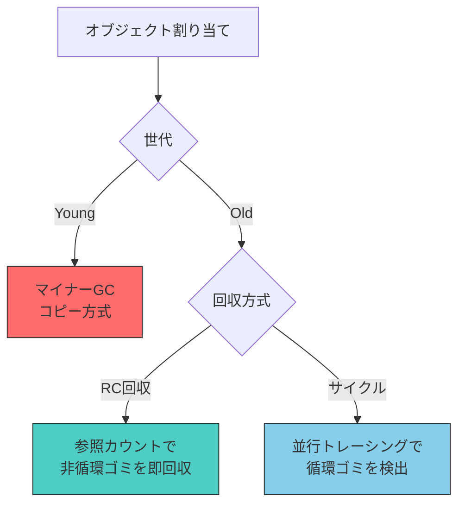

# トレーシングと参照カウントの統一理論

## 双対性

[Bacon, Cheng, Rajan](#cite:bacon2004)の2004年のOOPSLA論文 "A Unified Theory of Garbage Collection" は、GC研究における最も影響力のある理論的成果の一つである。彼らは、トレーシングGCと参照カウントが同一の問題の双対（dual）であることを形式的に示した。

基本的な洞察は以下の通りである。

- **トレーシング**: 生きているオブジェクト（matter）に注目し、ルートから到達可能なオブジェクトを積極的に同定する
- **参照カウント**: 死んだオブジェクト（anti-matter）に注目し、参照が消滅したことを追跡する



## 形式的定義

### 抽象フレームワーク

統一理論では、全てのGCアルゴリズムを**fix-point computation**（不動点計算）として定式化する。

```ruby
module UnifiedGC
  # 抽象的なGCフレームワーク
  # tracingとref_countingは同じフレームワークのインスタンス

  # 全てのGCは以下の不動点を計算する:
  # Live = {o | o ∈ Roots ∨ ∃p ∈ Live : o ∈ children(p)}

  # トレーシング: 前方から不動点に近づく（ルートから到達可能を拡大）
  def self.tracing(heap, roots)
    live = Set.new
    worklist = roots.dup

    # 不動点まで繰り返し
    until worklist.empty?
      obj = worklist.pop
      next if live.include?(obj)
      live.add(obj)
      obj.fields.each { |child| worklist.push(child) if child }
    end

    # 補集合がゴミ
    garbage = heap.objects - live
    garbage
  end

  # 参照カウント: 後方から不動点に近づく（非到達を縮小）
  def self.ref_counting(heap, roots)
    # 各オブジェクトの参照カウントを計算
    heap.objects.each { |obj| obj.ref_count = 0 }
    roots.each { |r| r.ref_count += 1 }
    heap.objects.each do |obj|
      obj.fields.each { |child| child.ref_count += 1 if child }
    end

    # カウント0のオブジェクトを回収（伝播）
    garbage = Set.new
    worklist = heap.objects.select { |o| o.ref_count == 0 }

    until worklist.empty?
      obj = worklist.pop
      garbage.add(obj)
      obj.fields.each do |child|
        next unless child
        child.ref_count -= 1
        worklist.push(child) if child.ref_count == 0
      end
    end

    garbage
  end
end
```

### 双対の数学的構造

この双対性をより明確にするために、GCをラティス（束）上の不動点計算として定式化できる。

```math
\text{Live} = \mu X. \text{Roots} \cup \{o \mid \exists p \in X : o \in \text{children}(p)\}
```

- **トレーシング**: 最小不動点（least fixed point）に下から近づく。空集合から始めて、到達可能なオブジェクトを追加していく。
- **参照カウント**: 最大不動点（greatest fixed point）に上から近づく。全オブジェクトの集合から始めて、到達不可能なオブジェクトを除去していく。

## ハイブリッドアルゴリズム

統一理論の実用的な帰結として、トレーシングと参照カウントを組み合わせた[ハイブリッドアルゴリズム](#index:ハイブリッドGC)が体系的に導出できる。

### RC + サイクルトレーシング

最も一般的なハイブリッドは、参照カウントでほとんどのゴミを回収し、サイクルゴミのみトレーシングで回収するパターンである。CPythonがこのパターンの代表的な実装である。CPythonは通常の参照カウントで大部分のオブジェクトを即時回収し、`gc`モジュールのサイクルコレクタ（世代別のトライアル削除）で循環ゴミを回収する。PHP 5.3以降も同様に参照カウント+サイクルコレクタのハイブリッドを採用している。

```ruby
class HybridRCTracing
  def initialize(heap)
    @heap = heap
    @cycle_candidates = []
  end

  # 通常のポインタ更新: RC
  def write(src, field_idx, new_ref)
    old_ref = src.fields[field_idx]
    increment(new_ref) if new_ref
    src.fields[field_idx] = new_ref
    decrement(old_ref) if old_ref
  end

  def decrement(obj)
    obj.ref_count -= 1
    if obj.ref_count == 0
      # 即座に回収
      obj.fields.each { |c| decrement(c) if c }
      free(obj)
    else
      # カウント > 0 だがサイクルの一部かもしれない
      @cycle_candidates << obj
    end
  end

  # 定期的にサイクルを回収
  def collect_cycles
    # Bacon-Rajanアルゴリズムまたは
    # 部分的なトレーシングでサイクルを検出・回収
    trial_deletion(@cycle_candidates)
    @cycle_candidates.clear
  end
end
```

### 遅延RC + 世代別トレーシング

もう一つのハイブリッドは、遅延参照カウント（スタックからの参照をカウントしない）と世代別トレーシングを組み合わせるパターンである。LXR（[6. リージョンベースGC](06-region-based.md)参照）はこのアプローチを洗練させたものと見なせる。また、Nim言語のORC（Ownership + Reference Counting）もトレーシングとRCのハイブリッドであり、サイクルコレクタを必要に応じて起動する設計となっている。



## 統一理論の意義

この統一理論は、以下の点で重要な貢献をした。

1. **設計空間の明確化**: トレーシングとRCを二項対立ではなく、連続的なスペクトラムとして捉えることで、新しいアルゴリズムの設計空間が広がった

2. **既存アルゴリズムの再理解**: 世代別GCはトレーシング側から見た「部分的な回収」であり、遅延RCはRC側から見た「部分的な追跡」であるという統一的な理解が得られた

3. **ハイブリッドの体系的設計**: 2つの手法の組み合わせ方を形式的に導出できるようになった

> [!NOTE]
> 統一理論以降、純粋なトレーシングや純粋な参照カウントよりも、両者のハイブリッドが主流になりつつある。LXRはその代表例であり、RCによるSTW時の高速回収と、並行トレーシングによるサイクル回収を組み合わせている。実用処理系ではCPython（RC+サイクルトレーシング）、Swift（ARC+弱参照によるサイクル回避）、Nim（ORC）が代表的なハイブリッド実装である。JVM系GC（G1, ZGC）は純粋なトレーシングに見えるが、世代別GCという「部分的なトレーシング」を行っている点で、統一理論の視点からはスペクトラムの中間に位置づけられる。

## コスト分析

### トレーシングのコスト

トレーシングGCのコストは生存オブジェクトの数に比例する。

```math
C_{\text{tracing}} \propto |\text{Live}| + |\text{Roots}|
```

生存率（live ratio）が低いほど効率的である。世代別GCで若い世代を頻繁に回収するのは、若い世代の生存率が低いからである。

### 参照カウントのコスト

参照カウントのコストはポインタ更新の回数に比例する。

```math
C_{\text{RC}} \propto |\text{Mutations}|
```

ポインタ更新が少ないプログラム（関数型言語など）ではRCのオーバーヘッドが小さい。逆に、ポインタを頻繁に書き換えるプログラムではRCのコストが高くなる。

### 最適な選択

[Blackburn et al.](#cite:blackburn2004)は、GC方式の選択がアプリケーションの特性に大きく依存することを実証的に示した。

```ruby
# GC方式選択の概念的なガイドライン
def choose_gc_strategy(workload)
  case
  when workload.short_lived_ratio > 0.9
    :generational_copying  # 世代仮説が強く成立
  when workload.mutation_rate < 0.1
    :reference_counting    # ポインタ更新が少ない
  when workload.heap_size > 10.gb && workload.latency_sensitive
    :concurrent_region     # 大ヒープ + 低レイテンシ要件
  when workload.real_time?
    :incremental_hybrid    # リアルタイム制約
  else
    :generational_mark_sweep  # 汎用的なデフォルト
  end
end
```

## 今後の展望

統一理論の枠組みは、今後も新しいGCアルゴリズムの設計に指針を与え続けるだろう。特に、以下の方向性が注目される。

- **コンパイラ連携**: Perceusのように、コンパイラの静的解析とRCを組み合わせることで、実行時のオーバーヘッドを最小化する。Koka言語で実用化されており、SwiftのARCも同じ方向性にある
- **ワークロード適応**: プログラムの動的特性に基づいて、トレーシングとRCの比重を自動的に調整する。HotSpot JVMのAdaptive Size Policyは世代サイズの自動調整を行っており、この方向性の先駆けと言える
- **ハードウェア支援**: メモリアクセスパターンの監視をハードウェアで行い、GC戦略にフィードバックする。Azul Vegaプロセッサは専用のリードバリアハードウェアを搭載していた歴史があり、ARM MTEの活用も検討されている
