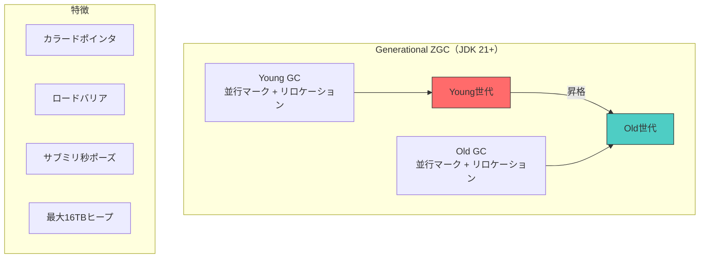
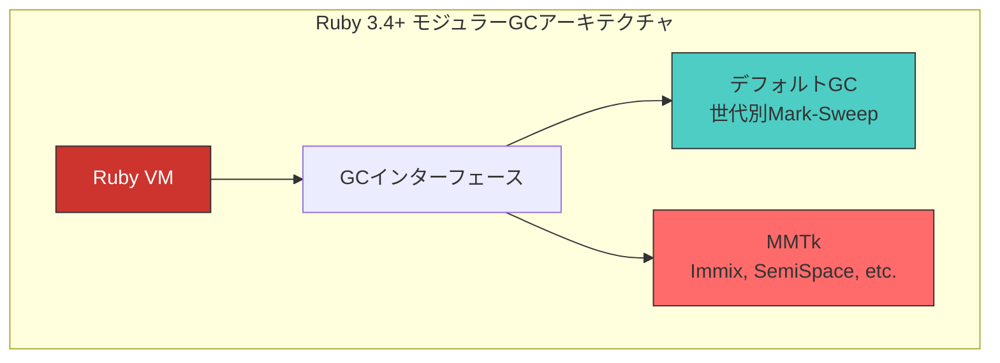

# 主要処理系のGC実装

## JVM: GCの最前線

Java仮想マシン（JVM）は、GC研究の最大の実験場であり続けている。OpenJDKには複数のGCが搭載されており、ユーザがワークロードに応じて選択できる。

### G1 GC

[G1](#index:G1 GC)（Garbage-First）は[](#cite:detlefs2004)が設計し、JDK 9以降のデフォルトGCとなっている。リージョンベースの世代別並行GCで、予測可能な停止時間を目標とする。

主要な特徴:
- ヒープを1〜32MBの等サイズリージョンに分割
- リメンバードセットによるリージョン間参照の追跡
- 並行マーキング（SATBバリア）
- Mixed GC: 若い世代とゴミの多い古い世代リージョンを同時回収

### ZGC

[ZGC](#index:ZGC)はJDK 15で正式導入された超低レイテンシGCである[](#cite:yang2022)。当初は非世代別だったが、JDK 21で世代別モード（Generational ZGC）が導入され、性能が大幅に向上した。さらにJDK 23（JEP 474）で世代別モードがデフォルトとなり、JDK 24（JEP 490）では非世代別モードが完全に削除された。2026年現在、ZGCは事実上「世代別のみ」である。世代仮説に基づいて若いオブジェクトを優先回収することで、非世代別ZGCが抱えていた「全ヒープを毎回スキャンする」コストを解消した点が大きい。



ZGCの技術的なポイント:
- **カラードポインタ**: 64ビットポインタの未使用ビットにGCメタデータを格納
- **ロードバリア**: ポインタ読み込み時にGC状態をチェックし、必要に応じて自己修復
- **マルチマッピング**: 同一物理メモリを異なる仮想アドレスにマッピング

### Shenandoah

[Shenandoah](#index:Shenandoah)はRed Hatが開発した並行コンパクションGCである[](#cite:flood2016)。ZGCとは異なるアプローチで、ヒープサイズに依存しない短い停止時間を実現する。

初期のShenandoah（OpenJDK 12以前）は、各オブジェクトの先頭に余分な1ワードの間接参照ポインタ（[Brooks pointer](#index:Brooks Pointer)）を置き、オブジェクトへのアクセスを常にこのポインタ経由で行うことで並行移動を実現していた。しかしこの方式は、すべてのフィールドアクセスにリードバリアのコストを課すうえ、オブジェクトごとに1ワードのメモリオーバーヘッドを生じる難点があった。

JDK 13でShenandoahはバリアモデルを**ロードリファレンスバリア（Load Reference Barrier, LRB）**へと刷新した。LRBは、ヒープから参照を読み込んだ時点でのみその参照を最新の転送先に解決する方式で、フィールドアクセスごとの読み込みコストを大幅に削減した。これにより余分な転送ポインタワードも不要となり、ZGCのカラードポインタとは異なる手段で同等の低レイテンシを達成している。「Shenandoahといえばbrooks pointer」という理解は、2026年時点では古い知識である点に注意したい。

### JVM GC比較（2026年時点）

| GC | 最大ポーズ | スループット | ヒープサイズ | JDKバージョン |
|----|-----------|-------------|-------------|--------------|
| G1 | 数ms〜数十ms | 高 | 〜数TB | 9+（デフォルト） |
| ZGC | <1ms | 中〜高 | 〜16TB | 15+（21+で世代別、24+は世代別のみ） |
| Shenandoah | <1ms | 中 | 〜数TB | 12+ |
| Parallel GC | 数百ms〜数s | 最高 | 〜数TB | 全バージョン |

> [!TIP]
> JVM 17以降では、ZGCとShenandoahの両方が本番環境で十分に成熟している。レイテンシ要件が厳しい場合はこれらを検討すべきである。ただし、スループットが最優先の場合はG1やParallel GCの方が適している場合もある。

## Go: シンプルさの追求

Go言語のGCは、設計哲学として**シンプルさ**を重視している。

### 現行方式

Goは非世代別の並行Mark-Sweepを採用している。三色マーキングを行い、ミューテータは並行に動作する。

ライトバリアは、Go 1.8以降、Dijkstra方式の挿入バリア（insertion barrier）とYuasa方式の削除バリア（deletion barrier）を組み合わせた**ハイブリッドライトバリア**を採用している。Dijkstra方式（インクリメンタルアップデート）は新たに張られた参照を捕捉し、Yuasa方式（スナップショット）は消去される直前の参照を捕捉する。両者を併用することで、マーキング終了時にスタックを再走査するためのSTW（Stop-the-World）を不要にし、停止時間を大幅に短縮した。挿入バリア・削除バリアの理論的背景は「並行・並列GC」の章で扱ったとおりである。

特徴:
- **非移動式**: オブジェクトは移動しない（内部ポインタの安全性）
- **並行**: STW時間は通常数百マイクロ秒以下
- **非世代別**: ヒープ全体をスキャン
- **ペーサー**: GCのタイミングをヒープ使用量に基づいて動的に調整

```ruby
# GoのGCペーサーの概念
class GoPacer
  def initialize
    @gc_percent = 100  # GOGC: ヒープ成長率の閾値
    @heap_goal = 0
  end

  def should_trigger_gc?(current_heap_size, last_gc_heap_size)
    @heap_goal = last_gc_heap_size * (1.0 + @gc_percent / 100.0)
    current_heap_size >= @heap_goal
  end

  # メモリリミットによるトリガー（Go 1.19+）
  def soft_memory_limit_trigger?(current_total, limit)
    current_total >= limit * 0.9
  end
end
```

### Green Tea GC

Green Tea GCは、Goのマーキングの並列スケーラビリティと空間局所性を改善する試みである。従来のGoのマーカーはオブジェクトを1つずつポインタ追跡（ポインタチェイス）していくため、ヒープ全体に散らばるオブジェクトへのランダムアクセスがキャッシュミスを多発させ、メニーコア環境でスケールしにくいという問題があった。

Green Teaは、マーキングの単位をオブジェクトから**メモリページ（スパン）**へと変える。具体的には、ページ全体をグローバルなワークリストで管理し、ページ内の個々のオブジェクトのマーク状態はローカルに追跡する。これにより、空間的に近接したオブジェクトをまとめて走査でき、キャッシュ効率とマーカースレッド間の競合の両方が改善する。Goチームの報告では、GCに費やす時間が多くのワークロードで約10%、GC負荷の高いワークロードでは最大40%削減されたという[](#cite:goblog2025greentea)。

Green Teaは2025年8月リリースのGo 1.25に、環境変数`GOEXPERIMENT=greenteagc`を付けてビルドすることで有効になる実験的機能として導入された。すでにGoogle社内の本番環境でも使われており、Go 1.26でのデフォルト化が計画されている。

> [!NOTE]
> Goが世代別GCを採用しないのは、コンパイラのエスケープ解析によってスタック割り当てを積極的に行うことで、ヒープに割り当てられるオブジェクトの絶対数を減らしているためである。世代仮説が前提とする「大量の短命オブジェクト」がそもそも少ない。

## Ruby: モジュラーGCへの進化

### CRubyのGC

CRuby（MRI）のGCは、長年にわたって段階的に進化してきた。

- Ruby 1.8: 保守的Mark-Sweep
- Ruby 2.0: ビットマップマーキング、遅延スイープ
- Ruby 2.1: 世代別GC
- Ruby 2.2: インクリメンタルマーキング
- Ruby 3.2: 可変幅割り当て（Variable Width Allocation）
- Ruby 3.4: モジュラーGCインターフェース

### モジュラーGCとMMTk統合

[](#cite:wang2025ruby)は、CRubyのメモリ管理をモジュラー化し、[MMTk](#index:MMTk)（Memory Management Toolkit）との統合を実現した。これにより、CRubyのGCを外部の高性能GC実装に置き換えることが可能になった。



MMTk統合の技術的課題:
- CRubyの保守的スタックスキャンとMMTkの正確なGCとの整合性
- 内部ポインタ（C拡張からの直接参照）の扱い
- 既存のC拡張APIとの後方互換性

> [!IMPORTANT]
> CRubyのモジュラーGCは、成熟した処理系のGCをリアーキテクチャする際の実践的な知見の宝庫である。[](#cite:wang2025ruby)の報告は、理論と実践のギャップを埋める貴重なケーススタディとなっている。

## Python: 参照カウントとGILの解放

CPython（標準のPython実装）のメモリ管理は、参照カウントを基盤とし、それを補う形で循環参照を回収する世代別のサイクルコレクタ（3世代）を組み合わせている。Rubyがトレーシングを基盤とするのと対照的で、参照カウントの「即時回収」と「決定的なデストラクタ呼び出し」がPythonのセマンティクスに深く組み込まれている。

近年のCPythonは、この参照カウント基盤に大きな変更を加えている。

- **Python 3.12: 不死オブジェクト（PEP 683）**: `None`、`True`、`False`、小さな整数など、プログラムの生存期間中決して解放されないオブジェクトの参照カウントを固定値に「凍結」し、参照カウントの更新自体を省く。これは後述のGIL解放の布石でもある。
- **Python 3.13: フリースレッド（GILなし）ビルド（PEP 703）**: 長年Pythonの並列性を制約してきた[GIL](#index:GIL)（Global Interpreter Lock、グローバルインタプリタロック）を撤廃した実験的ビルドが導入された。

GILは、複数スレッドが同時にオブジェクトの参照カウントを更新して壊すことを防ぐための、インタプリタ全体を覆う排他ロックである。これを外すと参照カウントの更新が競合するため、PEP 703は3つの技術を組み合わせて解決した。

1. **バイアス付き参照カウント（biased reference counting）**: 「ほとんどのオブジェクトは生成したスレッドからしかアクセスされない」という観察に基づき、各オブジェクトに所有スレッドを記録する。所有スレッドからの更新は高速な非アトミック命令で、他スレッドからの更新だけが低速なアトミック操作になる。
2. **遅延参照カウント（deferred reference counting）**: スレッド間で頻繁に共有されるオブジェクトについては、参照カウントの更新をまとめて後で適用し、高価なアトミック操作の回数を減らす。
3. **不死化（immortalization）**: 上記の不死オブジェクトを使い、そもそもカウント更新が不要なオブジェクトを増やす。

> [!NOTE]
> サイクルコレクタにも変化があった。停止時間短縮を狙ったインクリメンタル方式がPython 3.14で一度導入されたが、3.14.5で従来の世代別方式に差し戻され、再導入はPEPプロセスを経て3.16以降が検討されている。GCの設計変更が成熟した処理系では一筋縄ではいかないことを示す好例である。

Pythonのこれらの動向は、第3章で扱った参照カウントと、第9章で扱う「参照カウントの復権」のトレンドが、研究だけでなく主要処理系の実装でも現実に進行していることを示している。

## Julia: 科学計算のためのGC

Julia言語は、動的型付けでありながら高性能な科学計算を目指す言語である。[](#cite:wang2025julia)は、JuliaのGCをリアーキテクチャし、MMTkとの統合を進めている。

Juliaの既存GCは非移動式のトレーシングGCであり、フラグメンテーションと局所性の問題を抱えている。コピーGCの導入が望まれるが、高性能ランタイムにコピーGCを後から統合する際の課題が詳細に報告されている。

## .NET: サーバワークロード向け最適化

.NETのGCは、世代別Mark-Compact方式を採用している。

特徴:
- 3世代（Gen 0, Gen 1, Gen 2）+ LOH（Large Object Heap、約85KB以上の大きなオブジェクト用）
- サーバGCモード: コアごとに独立したヒープとGCスレッドを持ち、スループットを最大化
- バックグラウンドGC: Gen 2（および LOH）の回収をミューテータと並行実行
- Pinning: ネイティブコードへ渡す間オブジェクトのアドレスを固定する操作。コンパクションを妨げ断片化の原因となる
- POH（Pinned Object Heap）: .NET 5以降、固定されるオブジェクトを専用ヒープに集約し、通常ヒープの断片化を避ける
- Region-based: .NET 7以降、従来のセグメント方式に代えてリージョンベースのヒープ管理へ移行し、メモリの返却やヒープサイズの調整を柔軟化

## OCaml: 関数型言語のGC

OCamlのGCは関数型言語向けに最適化されている。

- マイナーヒープ: コピーGC（Cheneyアルゴリズム）
- メジャーヒープ: インクリメンタルMark-Sweep + コンパクション
- OCaml 5.0: マルチコア対応（並列マイナーGC）

OCaml 5.0のマルチコアGCは、各ドメイン（スレッド）が独自のマイナーヒープを持ち、マイナーGCをドメインごとに独立して実行する。ドメイン間参照はリメンバードセットで追跡される。

## JavaScript（V8）: ブラウザを支えるGC

V8はGoogle ChromeとNode.jsで使われるJavaScriptエンジンであり、世界で最も実行回数の多いGCの一つを抱えている。V8のGCは世代別で、世代仮説に強く依存する設計になっている。

- **若い世代（new space）**: Cheney型のコピーGC（Scavenger）。2つの半空間を行き来させ、生き残ったオブジェクトを2回のScavengeを経て老世代へ昇格させる。並列実行される。
- **老世代（old space）**: Mark-Sweep / Mark-Compactで回収する。並行マーキングとインクリメンタルマーキングを併用し、停止時間を抑える。

V8のGC群はOrinocoというプロジェクト名で総称され、**並列（parallel）・並行（concurrent）・インクリメンタル（incremental）**の3つの技術を組み合わせて、メインスレッド（JavaScript実行スレッド）の停止時間を最小化することを目標としている。マーキングの大部分をバックグラウンドスレッドで並行に進め、避けられない作業だけを短いインクリメンタルなステップに分割してメインスレッドの合間に差し込む。

ブラウザという対話的環境では、わずかな停止時間でもUIのカクつき（jank）として体感されるため、スループットよりも停止時間が重視される点がサーバ向けの.NETやJVMのParallel GCとは対照的である。

## メモリのOSへの返却とコンテナ協調

GCが「回収した」メモリは、多くの場合まず処理系自身のヒープ（フリーリストや空きリージョン）に戻るだけで、OSに返却されるわけではない。アプリケーションのフットプリント（OSから見たプロセスの実メモリ使用量, RSS）を実際に減らすには、**OSへのメモリ返却**という別の段階が必要になる。これは2026年のクラウド・コンテナ環境では、コスト（割り当てメモリ量に課金される）と安定性（メモリ上限超過によるOOMキル）の両面で死活的に重要なテーマである。

### OSへの返却機構

OSへ物理メモリを返す主な手段は、`munmap`による完全な解放と、`madvise`による助言的な返却である。後者には2つの方式がある。

- **`MADV_DONTNEED`**: 該当ページを即座に解放する。RSSはすぐ下がるが、その領域を再利用するときにページフォルトとゼロクリアのコストがかかる。
- **`MADV_FREE`**: 「このページはもう要らないが、メモリ逼迫時まで解放を遅らせてよい」とOSに助言する。逼迫しなければ再利用は安価だが、その間RSSは下がって見えない（監視ツール上の混乱を招くことがある）。

この「すぐ返して再利用コストを払う」か「抱えたまま性能を優先する」かのトレードオフは、各処理系のチューニングの勘所である。ZGCやShenandoahは、使われなくなったヒープリージョンをOSへ返す**uncommit**機能を備え、アイドル時にフットプリントを縮小できる。

### コンテナ・メモリ制限との協調

コンテナ環境では、cgroupによってプロセスが使えるメモリの上限が定められる。GCを持つ処理系がこの上限を認識せずに「マシン全体の物理メモリ」を基準にヒープを拡大すると、上限を超えてカーネルにOOMキルされる。かつてのJVMはこの問題を抱えていたが、JDK 10以降はcgroupを認識し、`-XX:MaxRAMPercentage`で「コンテナに与えられたメモリの何%までヒープに使うか」を指定できるようになった。

Goでは、Go 1.19で導入された**ソフトメモリ制限**`GOMEMLIMIT`がこの問題への解となる。これは「この量に近づいたらGCをより積極的に走らせてメモリ増加を抑える」という柔らかい上限で、従来のヒープ成長率ベースの`GOGC`と組み合わせて使う。ハードな上限ではないため、メモリと引き換えにスループットを犠牲にしてでもOOMを避ける、という挙動になる。本章のはじめに示したGoペーサーの`soft_memory_limit_trigger?`は、まさにこの仕組みの概念を表したものである。

> [!TIP]
> 「GCがメモリを回収しているのにRSSが下がらない」という相談は実務で頻出するが、その多くは回収アルゴリズムの問題ではなく、この「OSへの返却」と「`MADV_FREE`の遅延解放」の理解不足に起因する。回収（reclaim）・返却（return to OS）・実メモリ（RSS）は別の層の話だと切り分けることが重要である。

## ファイナライザの現代的な扱い

[第2章](02-tracing.md)で見たように、ファイナライザには復活・順序不定・タイミング非決定性といった本質的な問題がある。その結果、2026年現在の主要処理系には共通したコンセンサスが形成されている。すなわち、**外部リソースの解放はファイナライザに頼らず、スコープベースの明示的な後始末で行う。ファイナライザは「明示的解放を忘れた場合の最後の安全網」に格下げする**、というものである。各処理系はこの方針に沿ってAPIを刷新してきた。

### Java: finalize()の廃止とCleaner

Javaの`Object.finalize()`は、上述の問題点ゆえにJava 9で非推奨となり、JEP 421によりJava 18で「削除予定」として明確に廃止の道筋がつけられた。代替として推奨されるのが、Java 9で導入された`java.lang.ref.Cleaner`である。Cleanerは内部的にファントム参照を用い、登録されたオブジェクトが到達不可能になったときに後始末アクションを実行する。

```ruby
# Cleanerの考え方（疑似コード）
# 後始末アクションは、対象オブジェクト自身を絶対に参照してはならない。
# 参照すると対象が到達可能のままになり、永遠に回収されない（=復活と同じ罠）。
cleaner = Cleaner.new
resource = NativeBuffer.new(fd)            # 解放したいネイティブ資源
state = { fd: resource.fd }                # 対象オブジェクトを含まない後始末用の状態
cleaner.register(resource, -> { close(state[:fd]) })
```

Cleanerの設計の肝は、「後始末アクションのクロージャが対象オブジェクトをキャプチャしてはならない」という制約である。これは第2章で述べた復活の罠を、APIレベルで回避させるための工夫である。

### .NET: IDisposableパターン

.NETでは、決定的な解放のために`IDisposable`インターフェースと`using`構文（C#）を用いるのが基本である。ファイナライザ（C#のデストラクタ構文 `~ClassName`）は、`Dispose`の呼び忘れに備えた安全網としてのみ実装する。`Dispose`が明示的に呼ばれた場合は`GC.SuppressFinalize`でファイナライザ実行を抑止し、二重解放と無駄なファイナライゼーションコストを避ける。ネイティブハンドルは`SafeHandle`でラップし、ハンドルのリークやファイナライズ順序の問題を型レベルで防ぐのが現代的な作法である。

### Go: SetFinalizerからAddCleanupへ

Goは長らく`runtime.SetFinalizer`を提供してきたが、これには「循環に含まれるオブジェクトをファイナライズできない」「オブジェクトを復活させてしまう」「1オブジェクトに1つしか設定できない」といった制約があった。Go 1.24（2025年）では、これらの欠点を解消した`runtime.AddCleanup`が追加された。AddCleanupは復活を起こさず、循環の一部でも動作し、複数登録も可能な、より安全な設計になっている。決定的な後始末には従来どおり`defer`を用いるのが第一選択であり、AddCleanupはあくまで安全網という位置づけである。

### Python・Ruby: 動的言語での後始末

CPythonの`__del__`メソッドは、かつて循環参照に含まれると回収不能になり`gc.garbage`に溜まるという問題があったが、PEP 442（Python 3.4）の「安全なオブジェクトファイナライゼーション」により、循環内のオブジェクトもファイナライズできるよう改善された。それでも推奨されるのは、`with`文（コンテキストマネージャ）による決定的な解放と、`weakref.finalize`による弱参照ベースの後始末である。

Rubyでは`ObjectSpace.define_finalizer`でファイナライザを登録できるが、ここには有名な落とし穴がある。

```ruby
class Resource
  def initialize(fd)
    @fd = fd
    # NG: ブロックが self をキャプチャすると、オブジェクトが永遠に
    #     到達可能になり回収されない（=ファイナライザが動かない）
    # ObjectSpace.define_finalizer(self) { self.close }

    # OK: self を含まない値（ここでは fd）だけをキャプチャする
    ObjectSpace.define_finalizer(self, self.class.finalizer(@fd))
  end

  def self.finalizer(fd)
    proc { IO.for_fd(fd).close }   # self を参照しないクロージャを返す
  end
end
```

Java・Ruby・Goに共通するこの「ファイナライザのクロージャに対象オブジェクトを含めてはならない」という制約は、いずれも第2章で述べた**復活**を防ぐための同じ原理に由来している。Rubyでも実務上は、`File.open`にブロックを渡す形や`ensure`節による決定的な解放が推奨され、ファイナライザは最終手段とされる。

> [!TIP]
> ファイナライザに関する現代的な指針は処理系を問わず一貫している。「リソース解放は決定的な構文（`with`/`defer`/`using`/ブロック+`ensure`）で行い、ファイナライザは保険」である。GC実装者の視点では、ファイナライザのサポートはGCの停止時間と複雑さを増やすため、ファントム参照やCleanerのような「復活を許さない弱い通知機構」へ寄せていくのが趨勢である。

## 処理系横断の性能評価

[](#cite:wang2025icse)は2025年のICSEにおいて、異なる言語ランタイムのGC性能を横断的に評価するフレームワーク（GEAR）を提案した。ランタイムに依存しないメモリ操作プリミティブを定義し、GC実装の公平な比較を可能にした。

この研究の意義は、GCの性能比較がこれまで各処理系のベンチマーク内でしか行われてこなかった現状を打破し、処理系間の知見の共有を促進する点にある。
