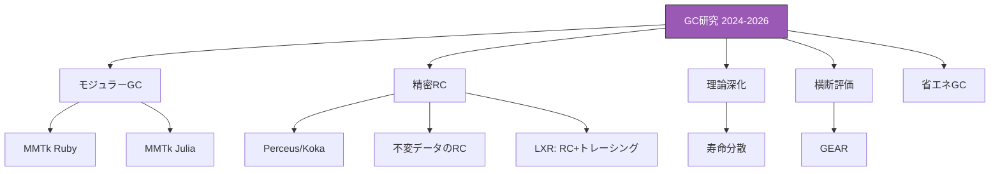
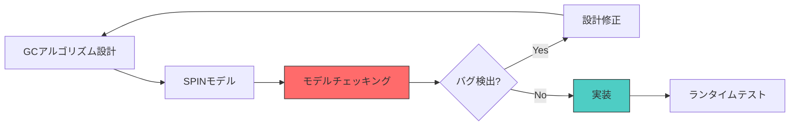

# 最新研究動向（2024〜2026年）

## 研究のトレンド概観

2024年から2026年にかけてのGC研究は、以下の大きなトレンドに沿って進展している。

1. **モジュラーGC**: 処理系とGCの分離、MMTkエコシステムの拡大
2. **参照カウントの復権**: コンパイラ支援による精密RCの実用化
3. **理論の深化**: 世代仮説の再定式化、統一理論の拡張
4. **処理系横断の評価**: GC性能のランタイム非依存な比較手法
5. **エネルギー効率**: GCの消費電力最適化



## モジュラーGCとMMTkの展開

### MMTkの新展開

MMTk（Memory Management Toolkit）は、Rust で書かれたモジュラーなGCフレームワークで、複数の言語処理系にプラグイン可能な設計となっている。2024〜2025年にかけて、以下の処理系への統合が進んだ。

- **Ruby**: [](#cite:wang2025ruby)が報告。Ruby 3.4でモジュラーGCインターフェースが導入され、MMTkバックエンドが実験的に利用可能に
- **Julia**: [](#cite:wang2025julia)が報告。非移動式GCからコピーGCへの移行の課題を詳細に分析

### モジュラーGCの意義

モジュラーGCは、言語処理系の開発者にとって以下のメリットをもたらす。

1. **アルゴリズムの交換可能性**: ワークロードに応じて最適なGCを選択
2. **研究の加速**: 新しいGCアルゴリズムを複数の処理系で即座に評価可能
3. **保守コストの分散**: GCの開発と保守を共通フレームワークに集約

```ruby
# モジュラーGCインターフェースの概念（簡略化）
module GCInterface
  # 処理系が実装すべきインターフェース
  def scan_roots
    raise NotImplementedError
  end

  def scan_object(obj)
    raise NotImplementedError
  end

  def object_size(obj)
    raise NotImplementedError
  end

  # GCフレームワークが提供するインターフェース
  def allocate(size, semantics)
    raise NotImplementedError
  end

  def trigger_collection
    raise NotImplementedError
  end
end

# MMTkのGCプラン選択
class MMTkConfig
  PLANS = {
    semi_space: "SemiSpace（コピーGC）",
    immix: "Immix（Mark-Region）",
    gen_immix: "GenImmix（世代別Immix）",
    mark_sweep: "MarkSweep",
    sticky_immix: "StickyImmix（世代別、非移動マーク）"
  }
end
```

> [!TIP]
> MMTkの最大の価値は、GC研究のエコシステム全体を変革する点にある。従来、新しいGCアルゴリズムの評価は特定のJVM（主にJikes RVM）に限られていたが、MMTkにより Ruby、Julia、V8 など多様な処理系で同一のGCを評価できるようになった。

## 参照カウントの最新研究

### 不変データのサイクル回収

[](#cite:leijen2024)は2024年のISMMにおいて、deeply immutableなデータ構造に含まれるサイクルを効率的に参照カウントで管理する手法を提案した。

ここで**強連結成分（Strongly Connected Component, SCC）**とは、有向グラフにおいて互いに行き来できるノードの極大集合を指す。参照グラフ上では、SCCはまさに循環参照の単位に対応する。**Union-Find（素集合データ構造）**は、要素をいくつかのグループに分け「ある要素がどのグループに属するか」「2つのグループを併合する」操作をほぼ定数時間で行えるデータ構造で、ここでは「どのオブジェクトが同じSCCに属するか」を効率的に管理するために使う。

アイデアの骨子:
1. 不変グラフは構築後に変化しないため、強連結成分（SCC）を一度だけ計算
2. SCC内のオブジェクトを1つの参照カウント単位として扱う（SCC全体が一斉に死ぬため、内部の循環参照は問題にならない）
3. Union-Find構造でSCCの等価クラスを効率的に管理

```ruby
class ImmutableCycleRC
  def initialize(graph)
    @uf = UnionFind.new(graph.nodes.size)
    @scc_ref_counts = {}
    compute_sccs(graph)
  end

  def compute_sccs(graph)
    # Tarjanのアルゴリズムで強連結成分を計算
    tarjan(graph).each do |scc|
      representative = scc.first
      scc.each { |node| @uf.union(representative, node) }
      @scc_ref_counts[@uf.find(representative)] = 0
    end
  end

  def increment(node)
    rep = @uf.find(node)
    @scc_ref_counts[rep] += 1
  end

  def decrement(node)
    rep = @uf.find(node)
    @scc_ref_counts[rep] -= 1
    free_scc(rep) if @scc_ref_counts[rep] == 0
  end
end
```

この研究は、関数型言語やイミュータブルデータを多用するプログラムにおいて、参照カウントの「サイクルに弱い」という従来の弱点を克服する可能性を示している。

### Perceusを発展させたFP²

[](#cite:lorenzen2023)のFP²（Fully in-Place Functional Programming）は、Perceusの再利用分析をさらに推し進め、関数型プログラムにおけるin-place更新の静的保証を確立した。

FP²の主な貢献:
- **FBIP（Functional But In-Place）プログラミング**: プログラマが意図的にin-place更新されるコードを書ける
- **線形リソース計算の一般化**: 借用（borrowing）とドロップの精密な制御
- **性能保証**: 特定のデータ構造操作がメモリ割り当てなしで実行されることを型レベルで保証

### 参照カウントで高スループットと低レイテンシを両立するLXR

参照カウントの復権を象徴するもう一つの成果が、[](#cite:zhao2022)による[LXR](#index:LXR)（Latency-critical Immix with Reference counting）である。従来、参照カウントは「スループットが低く実用的なランタイムには向かない」と見なされてきたが、LXRはこの通念を覆した。

LXRの要点は、参照カウントとトレーシングを組み合わせる点にある。

- 大半の回収を**遅延参照カウント**で即座に行い、短命オブジェクトを低コストで再利用する
- 参照カウントだけでは漏れる循環ゴミを、低頻度の**Immixベースのトレーシング**（バッキングトレース）で回収する
- Immixのライン／ブロック構造を利用して、移動可能なコンパクションも組み込む

結果として、LXRはトレーシングGC（G1やImmix）に匹敵するスループットを保ちながら、参照カウント由来の即時回収によって停止時間を抑え込む。これは「参照カウントは遅い」という長年の前提が、実装と最適化次第で覆ることを示した重要な事例である。FP²やPerceusがコンパイラ支援で精密RCを追求するのに対し、LXRはランタイム側でRCとトレーシングを融合させるアプローチであり、両者は相補的である。

## 世代仮説の再定式化と寿命分散

[](#cite:dolan2025)が2025年のISMMで発表した「Lifetime Dispersion and Generational GC」は、60年間自明とされてきた世代仮説に厳密な数学的基盤を与えた。

従来の問題:
- 「ほとんどのオブジェクトは若くして死ぬ」は直感的だが定量化が困難
- GC戦略に依存しない形での測定方法がなかった
- プログラムを合成した場合の挙動が予測不能

Dolanの提案:
- **寿命分散**: オブジェクト寿命の[ジニ係数](#index:ジニ係数)で定量化
- **合成可能性**: 複数プログラムのジニ係数から合成プログラムのジニ係数を導出可能
- **有効性との直結**: ジニ係数が高いほど世代別GCの効果が大きいことを形式的に証明

```ruby
# ジニ係数によるオブジェクト寿命分散の計算
def gini_coefficient(lifetimes)
  n = lifetimes.size
  return 0.0 if n == 0

  sorted = lifetimes.sort
  total = sorted.sum.to_f

  numerator = sorted.each_with_index.sum do |lifetime, i|
    (2 * (i + 1) - n - 1) * lifetime
  end

  numerator / (n * total)
end

# 具体例で見るジニ係数
# 例1: 全オブジェクトが同じ寿命（10ms）
gini_coefficient([10, 10, 10, 10, 10])  #=> 0.0
# → 世代別GCの効果なし。どのオブジェクトも同時期に死ぬため、
#   若い世代だけ回収しても意味がない。

# 例2: 典型的なWebリクエスト処理
#   リクエスト処理の一時オブジェクト（寿命1ms）が大量、
#   キャッシュやセッション（寿命10000ms）が少数
gini_coefficient([1, 1, 1, 1, 1, 1, 1, 1, 10000, 10000])  #=> 0.80
# → 世代別GCが非常に有効。若い世代のGCだけで80%のオブジェクト（10個中8個）を
#   回収でき、長寿オブジェクトを含む老世代のGCは稀で済む。

# 例3: 中程度の偏り
gini_coefficient([1, 2, 5, 10, 50])  #=> 0.62
# → 世代別GCにある程度の効果が期待できる。
```

> [!NOTE]
> 上記のジニ係数の値は、本文中の公式（ソート済み寿命列に対する標準的なGini計算）で実際に計算したものである。完全平等（例1）で0、偏りが大きいほど1に近づく。なお、ジニ係数の絶対値そのものより、同一指標で異なるワークロードを比較できることに意義がある。

ジニ係数の直感的な意味を、経済学のアナロジーで理解すると分かりやすい。経済学では所得格差を測る指標として使われ、0なら完全平等（全員が同じ所得）、1に近いほど格差が大きい（少数の富裕層が富を独占）。これをオブジェクト寿命に当てはめると、「短命オブジェクトと長寿オブジェクトの格差」を定量化していることになる。

実用上の計測方法としては、GCトレーシングツール（例: Javaの`-XX:+PrintGCDetails`やRubyの`ObjectSpace`）でオブジェクトの割り当て時刻と回収時刻を記録し、各オブジェクトの寿命を算出してジニ係数を計算する。Dolanの研究の重要な点は、こうした計測がGCアルゴリズムに依存しない形で行えること、そして複数のワークロードを合成した場合のジニ係数を個別のジニ係数から導出できる（合成可能性）ことである。

> [!NOTE]
> 寿命分散の概念は、GCアルゴリズムの選択やチューニングに定量的な指標を与える。これまで直感に頼っていた世代別GCの効き具合を、数値で見積もれるようになる。

## 処理系横断のGC評価

### ベンチマーク方法論とその落とし穴

GCの「良し悪し」を測ること自体が、実は難しい研究テーマである。[](#cite:blackburn2004)の「Myths and Realities」は、GC性能の測定が誤解を生みやすいことを実証した重要な論文である。たとえば、ヒープサイズを変えれば同じGCでもスループットと停止時間のバランスは劇的に変わるため、単一のヒープサイズでの比較は容易にミスリードを生む。また、JITウォームアップの影響、世代仮説に合わない人工的なマイクロベンチマーク、測定対象以外の要因（アロケータ、メモリ帯域）の混入なども、結果を歪める。

こうした反省から、現実的なワークロードを集めた標準ベンチマークスイートが整備されてきた。代表例が、Javaの実アプリケーションを集めた[](#cite:blackburn2006dacapo)と、並行ワークロードと並列ワークロードに重点を置いた[](#cite:prokopec2019renaissance)である。これらは「複数のヒープサイズで測る」「定常状態に達してから測る」といった方法論とセットで使われることで、GC研究の比較可能性を大きく高めた。

ただし、これらのスイートはいずれも特定のランタイム（主にJVM）に閉じている。「JavaのGCとGoのGCはどちらが優れているか」といった処理系をまたぐ問いには、ワークロード自体が言語ごとに異なるため答えられない。この限界を超えようとするのが、次に述べるGEARである。

### GEARフレームワーク

[](#cite:wang2025icse)が提案したGEAR（GC Evaluation Across Runtimes）は、異なる言語ランタイムのGC性能を公平に比較するためのフレームワークである。

GEARの設計:
1. **ランタイム非依存なメモリ操作プリミティブ（MOP）**: 割り当て、参照書き込み、オブジェクト生存パターンを抽象化
2. **一貫したワークロード生成**: MOPから各ランタイム向けのベンチマークを自動生成
3. **横断的な評価**: 同一の論理的ワークロードを異なるランタイムで実行し、GC性能を比較

この研究の実用的な意義は、言語選択の際にGC性能を客観的に比較できるようになる点である。

## エネルギー効率

近年、GCのエネルギー効率が新たな研究課題として浮上している。データセンターの消費電力削減やモバイルデバイスのバッテリ寿命延長において、GCの電力消費は無視できない要因である。

研究の方向性:
- GCの並列度とCPU周波数の動的制御
- GCタイミングとCPUのアイドル状態の協調
- エネルギー効率を目的関数に含めたGCチューニング

## 形式検証とGC

GCアルゴリズムの正しさを形式的に検証する取り組みも活発化している。[](#cite:yang2022)は、ZGCのC++実装25,000行に散在する並行動作の核心部分を、約900行のSPINモデルへと抽出し、定式化した。SPINは並行システムの状態空間を網羅的に探索するモデルチェッカーであり、このモデルによってミューテータとGCスレッド間のデータ競合がどのように解決されるかを解析でき、新しい設計アイデアのプロトタイピングにも利用できる。並行GCのバグは特定の実行順序でしか顕在化せず、通常のテストでの発見が極めて困難であるため、こうしたモデル検査の重要性は今後さらに高まると予想される。



## 研究の余地と今後の課題

2026年現在、以下の領域に大きな研究の余地が残されている。

1. **大規模ヒープの効率的管理**: 数TB規模のヒープに対するGCのスケーラビリティ
2. **NVMとの統合**: 不揮発メモリ上のGCの設計
3. **異種計算環境**: GPU/FPGAとCPUが混在する環境でのメモリ管理
4. **機械学習の応用**: GCパラメータの自動チューニング、到達可能性の予測
5. **安全性の形式保証**: 全てのGC操作の正しさを型システムや証明支援系で保証
6. **WebAssemblyのGC**: Wasm GC仕様はすでに策定され、出荷も済んでいる（第10章参照）。残る課題は、ホストGCと言語固有GCの協調、弱参照やファイナライザの効率的な実装、言語ランタイムのWasmへの移植コスト削減にある
