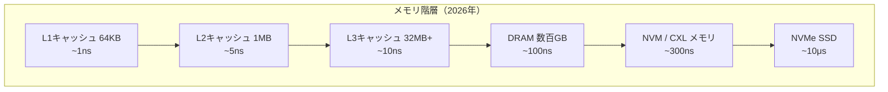

# 今後の展望

## GCの進化の方向性

本書で見てきたように、GCは60年以上にわたる研究の蓄積を持つ成熟した分野でありながら、2026年現在もなお活発な研究が続いている。ここからは、今後10年のGC研究と実装が向かう方向を見ていく。

## ハードウェアの変化とGC

### メモリ階層の変化

現代のハードウェアは、GCの設計に大きな影響を与えている。



特にCXL（Compute Express Link）メモリの普及は、GC設計に新たな課題と機会をもたらしている。

- **容量の大幅拡大**: CXLメモリにより数TB規模のヒープが実用的に
- **不均一なレイテンシ**: ローカルDRAMとCXLメモリの速度差を考慮したオブジェクト配置
- **帯域幅の制約**: コピーGCのメモリ帯域消費の最適化がより重要に

### ハードウェア支援GC

今後、以下のようなハードウェア支援がGCの性能を大幅に改善する可能性がある。

1. **メモリタグ拡張**: ARMのMTE（Memory Tagging Extension）をGCのメタデータ格納に活用
2. **ハードウェアバリア**: リードバリアやライトバリアのハードウェア実装
3. **アドレス空間の拡大**: ポインタの未使用ビットをGCメタデータに活用（ZGCのアプローチの発展）

```ruby
# 仮想的なハードウェア支援GCバリア
class HardwareAssistedBarrier
  # ハードウェアがポインタ読み込み時に自動的にチェック
  def hardware_load_barrier(address)
    # CPUのマイクロコードで実行（ソフトウェアコストなし）
    tagged_ptr = load_tagged(address)
    if tag_mismatch?(tagged_ptr, current_gc_phase)
      trap_to_gc_handler(tagged_ptr)  # スロウパスのみソフトウェア
    end
    strip_tag(tagged_ptr)
  end
end
```

## コンパイラとGCの融合

### 静的解析によるGC最適化

コンパイラの静的解析とGCの連携は、今後最も発展が期待される領域の一つである。

**エスケープ解析の深化**: 現在のエスケープ解析は関数単位が主流だが、プログラム全体の解析により、より多くのオブジェクトをスタック割り当てに変換できる。

```ruby
# エスケープ解析の概念
class EscapeAnalyzer
  def analyze(method)
    method.allocations.each do |alloc|
      case escape_state(alloc)
      when :no_escape
        # スタック割り当てに変換 → GC不要
        alloc.transform_to(:stack)
      when :arg_escape
        # 呼び出し先でのみ使用 → スカラ置換の可能性
        alloc.transform_to(:scalar_replacement)
      when :global_escape
        # ヒープ割り当て（通常通り）
        alloc.keep_as(:heap)
      end
    end
  end
end
```

**Perceusの拡張**: [](#cite:reinking2021)のPerceusは関数型言語向けだが、そのアイデアをオブジェクト指向言語に適用する研究が進んでいる。借用チェック（Rustスタイル）と参照カウントの組み合わせにより、より広い範囲のプログラムでGCなし実行が可能になるかもしれない。

### プロファイルガイドGC

実行時プロファイルに基づいてGC戦略を動的に調整する手法も有望である。基本的な発想は、**割り当てサイト**（オブジェクトを生成するソースコード上の位置）ごとに、生成されたオブジェクトの寿命やサイズの統計を実行時に収集し、その傾向に応じて割り当て方針を変えることである。

たとえば、ある割り当てサイトが常に短命なオブジェクトを生むと分かれば、それらを若い世代にバンプポインタ割り当て（高速な連続割り当て）して早期に一括回収する。逆に常に長寿命なオブジェクトを生むサイトに対しては、最初から老世代へ直接割り当てる**プリテニュアリング**を適用し、若い世代から老世代への無駄な昇格コピーを省く。サイズが一定なら、そのサイズ専用のアロケータを割り当てて断片化を抑える。これは第9章で扱ったDolanの寿命分散の議論を、割り当てサイト単位の動的最適化として実装に落とし込んだものと見ることもできる。

```ruby
# プロファイルガイドGCの概念
class ProfileGuidedGC
  def initialize
    @allocation_sites = {}
    @lifetime_histograms = {}
  end

  def record_allocation(site, obj)
    @allocation_sites[site] ||= AllocationSiteProfile.new
    @allocation_sites[site].record(obj)
  end

  def record_death(site, obj)
    lifetime = current_time - obj.birth_time
    @lifetime_histograms[site] ||= []
    @lifetime_histograms[site] << lifetime
  end

  def optimize_strategy
    @allocation_sites.each do |site, profile|
      case
      when profile.always_short_lived?
        # リージョンバンプ割り当て（即座に回収される）
        site.strategy = :bump_allocate_young
      when profile.always_long_lived?
        # 直接Old世代に割り当て（プリテニュアリング）
        site.strategy = :pretenure
      when profile.predictable_size?
        # サイズ特化のアロケータを使用
        site.strategy = :size_class_allocator
      end
    end
  end
end
```

## 新しいプログラミングパラダイムとGC

### 所有権とGCの統合

RustやValeのような所有権ベースの言語は、GCの必要性を大幅に削減している。しかし、完全にGCなしでは表現が困難なパターンも存在する（循環データ構造、コールバック、アクターモデルなど）。

今後の方向性として、所有権システムとGCの**段階的統合**が考えられる。

```ruby
# 仮想的な所有権+GCハイブリッドシステム
module OwnershipGCHybrid
  # 所有権で管理されるオブジェクト（GC不要）
  class Owned
    attr_reader :value
    # スコープ終了時に自動解放
  end

  # GC管理のオブジェクト（循環参照が必要な場合）
  class GCManaged
    attr_reader :value
    # GCによって回収
  end

  # コンパイラが自動的に判定
  def allocate(obj)
    if escape_analysis.no_cycles_possible?(obj)
      Owned.new(obj)       # 所有権管理
    else
      GCManaged.new(obj)   # GC管理
    end
  end
end
```

### アクターモデルとGC

ErlangやPonyのようなアクターモデル言語では、アクターごとに独立したヒープを持つことで、GCの影響を局所化できる。[](#cite:ueno2016)はマルチコア環境での関数型プログラムの完全並行GCを提案しており、このアプローチはアクターモデルと自然に調和する。

## WebAssemblyとGC

WebAssembly（Wasm）のGC提案は、ブラウザ上で動作するマネージド言語のための標準的なGCインターフェースを定義する。Wasm GCは2023年末にChrome 119とFirefox 120で出荷され、Safariも追随した。2026年時点では主要ブラウザで広く利用可能な標準機能となっている。

Wasm GCの特徴:
- 構造型（struct）と配列型（array）のGC管理オブジェクトをWasmの型システムに直接導入
- GCそのものはホスト（ブラウザ）側のランタイム（通常はV8やSpiderMonkeyのGC）が担い、Wasmモジュールは独自のGCを持ち込まずに済む
- これにより、Kotlin、Dart、OCamlなどのマネージド言語が、自前のGCをWasmへ移植する負担なしにブラウザ上で動作できる
- 課題は、言語固有のオブジェクト表現や弱参照・ファイナライザのセマンティクスを、共通のホストGCインターフェース上でどう表現するかにある

## GCレスの世界は来るか

Rustの成功を受けて、「GCは不要になるのではないか」という議論がある。しかし、以下の理由から、GCが消滅することは考えにくい。

1. **プログラマの生産性**: 所有権管理の認知的コストは低くない
2. **動的言語の需要**: Python、Ruby、JavaScriptなどの動的言語は依然として広く使われている
3. **ドメイン固有の要件**: データ分析、Web開発、プロトタイピングではGCの利便性が勝る
4. **循環データ構造**: グラフ構造やオブザーバーパターンなど、所有権だけでは管理が困難なケース

> [!NOTE]
> より現実的な未来像は、**GCの見えない化**である。コンパイラの進化により、プログラマが意識しなくても適切なメモリ管理が自動的に選択される世界が近づいている。所有権推論、エスケープ解析、精密RC、そしてフォールバックとしてのトレーシングGCが、シームレスに統合されるだろう。

## 研究者・実装者へのメッセージ

GC研究は、理論と実践が密接に結びついた分野である。[](#cite:jones2023)の教科書が示すように、基礎理論の深い理解が優れた実装を生み、実装の経験が新しい理論を触発する。

2026年のGC研究で特に重要だと筆者が考える課題を挙げる。

1. **MMTkエコシステムの拡大**: より多くの処理系への統合と、新しいGCアルゴリズムのMMTk上での実装
2. **コンパイラ-GC協調の深化**: エスケープ解析、Perceus型RC、所有権推論の統合
3. **形式検証の実用化**: 並行GCの正しさを実用的なコストで保証する手法
4. **ハードウェア進化への追従**: CXLメモリ、ARM MTE、新しいISA拡張への対応
5. **ワークロード多様化への対応**: 機械学習、ストリーム処理、サーバレスなど新しいワークロードへの最適化

GCは計算機科学の最も古いテーマの一つであると同時に、最もエキサイティングなテーマの一つであり続けている。
